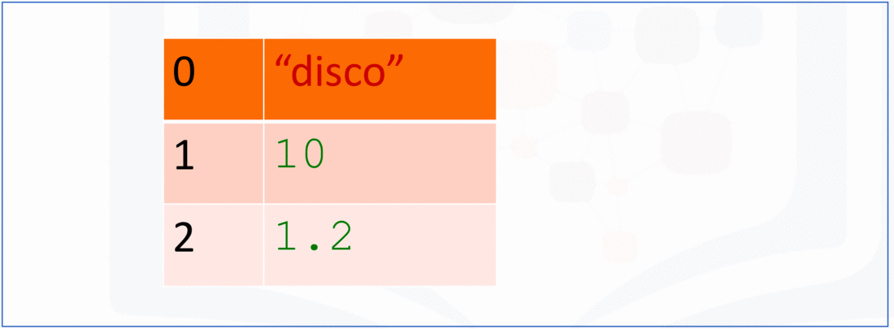
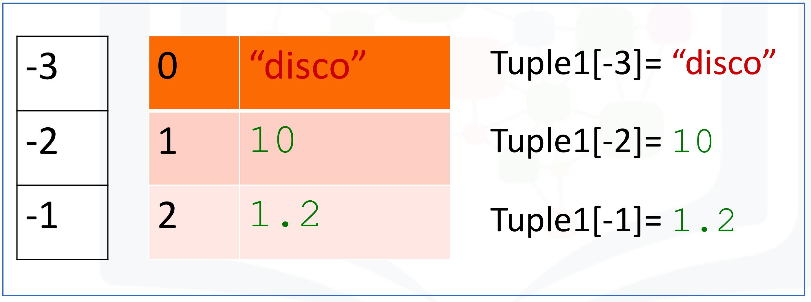
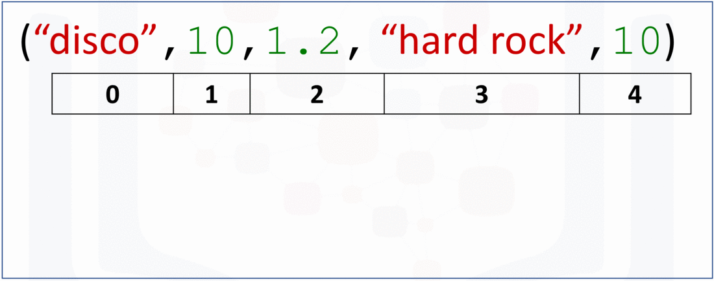
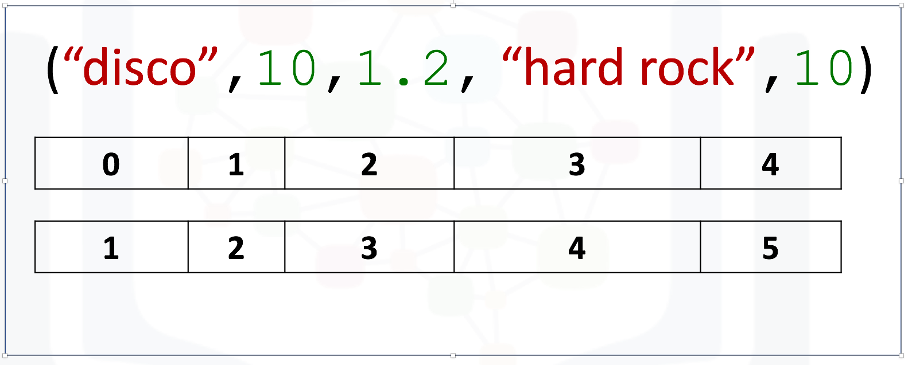
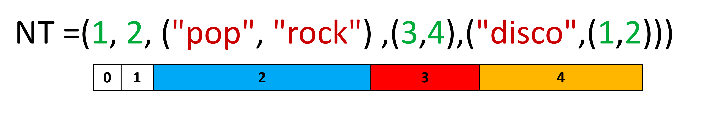
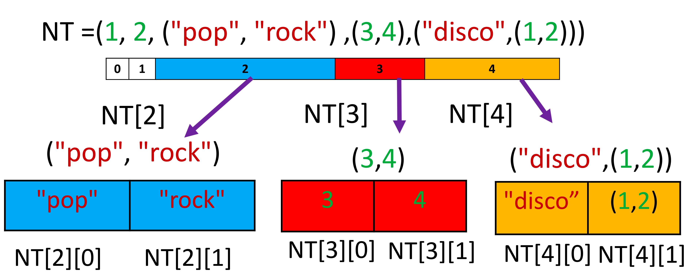
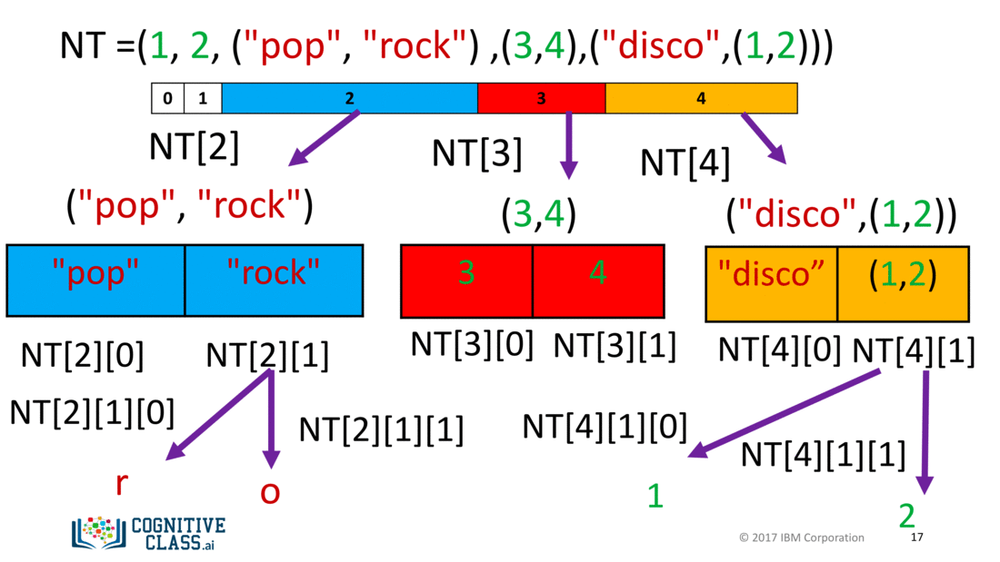
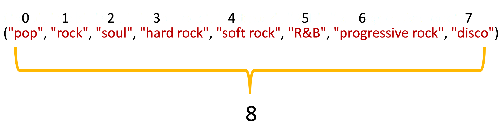

# 2.1.3 - Tuples in Python

## Objectives

After completing this lab you will be able to:

- Perform the basics tuple operations in Python, including indexing, slicing and sorting.

## Table of Contents

- [About the Dataset](#dataset)
- [Tuples](#tuples)
	- [Indexing](#indexing)
	- [Concatenate Tuples](#concatenate)
	- [Slicing](#slicing)
	- [Sorting](#sorting)
	- [Nested Tuple](#nested)
- [Quiz on Tuples](#quiz)

## About the Dataset <a id = "dataset"></a>

Imagine you received album recommendations from your friends and complied all of the recommandations into a table, with specific information about each album.

The table has one row for each movie and several columns:
- **Artist** - Name of the artist
- **Album** - Name of the album
- **Released_year** - Year the album was released
- **Length_min_sec** - Length of the album (hours, minutes, seconds)
- **Genre**- Genre of the album
- **Music_recording_sales_millions** - Music recording sales (millions in USD) on [SONG://DATABASE](http://www.song-database.com/?utm_medium=Exinfluencer&utm_source=Exinfluencer&utm_content=000026UJ&utm_term=10006555&utm_id=NA-SkillsNetwork-Channel-SkillsNetworkCoursesIBMDeveloperSkillsNetworkPY0101ENSkillsNetwork19487395-2021-01-01)

- **Claimed_sales_millions** - Album's claimed slaes (millions in USD) on [SONG://DATABASE](http://www.song-database.com/?utm_medium=Exinfluencer&utm_source=Exinfluencer&utm_content=000026UJ&utm_term=10006555&utm_id=NA-SkillsNetwork-Channel-SkillsNetworkCoursesIBMDeveloperSkillsNetworkPY0101ENSkillsNetwork19487395-2021-01-01)

- **Released** - Date on which the album was released

- **Soundtrack** - Indicates if the album is the movie soundtrack (Y) or (N)

- **Rating_of_friends** - Indicates the rating from your friends from 1 to 10.

The Dataset can be seen below:

|Artist| Album| Released| Length| Genre| Music recording slaes (millions)| Claimed slaes (millions) | Released| Soundtrack| Rating (freinds)|
|---|---|---|---|---|---|---|---|---|---|
|Michael Jackson| Thriller| 1982| 00:42:19| Pop, rock, R&B| 46| 65| 30-Nov-82| | 10.0|
| AD/DC| Back in Black| 1980| 00:42:11| hard rock| 26.1| 50| 25-Jul-80| | 8.5|
|Pick Floyd| The Dark Side of the Moon| 1973| 00:42:49| Progressive rock| 24.2| 45| 01-Mar-73| | 9.5|
|Whitney Houston| The Bodyguard| 1992| 00:57:44| Soundtrack/R&B, soul, pop| 26.1| 50| 25-Jul-80|Y|7.0|
|Meat Loaf| Bat Out of Hell|1977| 00:46:33| Hard rok, progressive rock| 20.6| 43| 21-Oct-77| | 7.0|
|Eagles| Their Greatest Hits (1971-1975)|1976|00:43:08| Rock, soft rock, folk rock| 32.2| 42| 17-Feb-76| | 9.5|
|Bee Gees| Saturday Night Fever| 1977| 1:15:54| Disco| 20.6| 40| 15-Nov-77| Y | 9.0|
|Fleet wood Mac| Rumours| 1977| 00:40:01| Soft rock | 27.9| 40| 04-Feb-77| | 9.5|

## Tuples <a id = "tuples"></a>

In python, There are different data types: String, Integer, and Float. These data types can all be contained in a tuple as follows:


Now, let us create your first tuple with string, integer and float.

```python
>>> tuple1 = ('disco', 10, 1.2)
>>> tuple1
('disco', 10, 1.2)
```

The type of variable is a **tuple**

```python
>>> type(tuple1)
<class 'tuple'>
```

### Indexing <a id= "indexing"></a>

Each element of a tuple can be accessed via an index. The following table represents the relationship between the index and the items in the tuple. Each element can be obtained by the name of the tuple followed by a square bracket with the index number:



We can print out each value in the tuple:

```python
>>> print(tuple1[0])
disco
>>> print(tuple1[1])
10
>>> print(tuple1[2])
1.2
```

We can print out the **type** of each value in the tuple:

```python
>>> type(tuple1)
<class 'tuple'>
>>> print(type(tuple1[0]))
<class 'str'>
>>> print(type(tuple1[1]))
<class 'int'>
>>> print(type(tuple1[2]))
<class 'float'>
```

We can also use negative indexing. We use the same table above with corresponding negative values:



We can obtain the last element as follows (this time we will note use the print statement to display the values):

```python
# Use negative index to get the value of the last element

>>> Tuple1 = ('disco', 10, 1.2)
>>> Tuple1[-1]
1.2
```

We can display the next two elements as follows:

```python
# Use negetive index to get the value of the second last element

>>> Tuple1[-2]
10
```

```python
# Use negative index to get the value of the third last element

>>> Tuple1[-3]
'disco'
```
### Concatenate Tuples <a a id = "concatenate"> </a>

We can concatenate or combine tuples by using the + sign:

```python
# Concatenate two tuples

>>> tuple1 = ('disco', 10, 1.2)
>>> tuple2 = tuple1 + ('hard rock', 10)
>>> tuple2
('disco', 10, 1.2, 'hard rock', 10)
```

We can slice tuples obtaining multiple values as demonstrated by the figure below:




### Slicing <a id = "slicing"></a>

We can slice tuples, obtaining new tuples with the corresponding elements:

```python
# Silce from index 0 to index 2
>>> tuple2[0:3]
('disco', 10, 1.2)
```

We can obtain the last two elements of the tuple:

```python
# Slice from index 3 to index 4
>>> tuple2[3:5]
('hard rock', 10)
```

We can obtain the length of a tuple using the length command:

```python
# Get the length of tuple

>>> len(tuple2)
5
```

This figure shows the number of elements:



### Sorting <a id = "sorting"></a>

Consider the following tuple:

```python
# A sample tuple

>>> Ratings = (0, 3, 5, 5, 6, 5, 5, 0, 0, 3)
>>> Ratings
(0, 3, 5, 5, 6, 5, 5, 0, 0, 3)
```

We can sort the values in a tuple and save it to a new tuple:

```python

>>> RattingsSorted = sorted(Ratings)
>>> RattingsSorted
[0, 0, 0, 3, 3, 5, 5, 5, 5, 6]
```

### Nested Tuple <a id = "nested"></a>

A tuple can contain another tuple as well as other more complex data types. This process is called 'nesting'. Consider the following tuple with several elements:

```python
>>> NestedT = (1, 2, ("pop", "rock"), (3, 4), ("disco", (1, 2)))
>>> NestedT
(1, 2, ('pop', 'rock'), (3, 4), ('disco', (1, 2)))
```

Each element in the tuple, including other tuples, can be obtained via an index as shown in the figure:



```python
# Print element on each index

>>> print("Element 0 of Tuple: ", NestedT[0])
Element 0 of Tuple:  1
>>> print("Element 1 of Tuple: ", NestedT[1])
Element 1 of Tuple:  2
>>> print("Element 2 of Tuple: ", NestedT[2])
Element 2 of Tuple:  ('pop', 'rock')
>>> print("Element 3 of Tuple: ", NestedT[3])
Element 3 of Tuple:  (3, 4)
>>> print("Element 4 of Tuple: ", NestedT[4])
Element 4 of Tuple:  ('disco', (1, 2))

```

We can use thhhe second index to access other tuples as demonstrated in the figure:



We can access the nested tuples:

```python
>>> print("Element 2, 0 of Tuple: ", NestedT[2][0])
Element 2, 0 of Tuple:  pop
>>> print("Element 2, 1 of Tuple: ", NestedT[2][1])
Element 2, 1 of Tuple:  rock
>>> print("Element 3, 0 of Tuple: ", NestedT[3][0])
Element 3, 0 of Tuple:  3
>>> print("Element 3, 1 of Tuple: ", NestedT[3][1])
Element 3, 1 of Tuple:  4
>>> print("Element 4, 0 of Tuple: ", NestedT[4][0])
Element 4, 0 of Tuple:  disco
>>> print("Element 4, 1 of Tuple: ", NestedT[4][1])
Element 4, 1 of Tuple:  (1, 2)
```

We can access strings in the second nested tuples using a third index:

```python
# Print the first element in the second nested tuples

>>> NestedT[2][1][0]
'r'
```

```python
# Print the second element in the second nested tuples;

>>> NestedT[2][1][1]
'o'
```

We can use a tree to visualise the process. Each new index corresponds to a deeper level in the tree:


Similarly, we can access elements nested deeper in the tree with a third index:

```python
# Print the first eleemnt in the second nested tuples

>>> NestedT[4][1][0]
1
```

```python
# Print the second element in the second nested tuples

>>> NestedT[4][1][1]
2
```

The following figure shows the relationship of the tree and the element `NestedT[4][1][1]:`



## Quiz on Tuples <a id="quiz"></a>

Consider the following tuple:

```python
>>> genres_tuple = ('pop', 'rock', 'soul', 
... 'hard rock', 'soft rock', 'R&B', 'progressive rock', 'disco')
>>> genres_tuple
('pop', 'rock', 'soul', 'hard rock', 'soft rock', 'R&B', 'progressive rock', 'disco')
```
Find the length of the tuple `genres_tuple`:

```python
# Write your code below and press Shift+Enter to execute

>>> len(genres_tuple)
8
```

[text](2-1-3-Tuples-in-Python.md) 

Access the element, with respect to index 3:

```python
# Write your code below and press Shift+Enter to execute

>>> genres_tuple[3]
'hard rock'
```

Use slicing to obtain indexes 3, 4, and 5:

```python
# Write your code below and press Shift+Enter to execute

>>> genres_tuple[3:6]
('hard rock', 'soft rock', 'R&B')
```

Find the first two elements of the tuple `genres_tuple`:

```python
# Write your code below and press Shift+Enter to execute

>>> genres_tuple[:2]
('pop', 'rock')
```

Find the first index of `disco`:

```python
genres_tuple.index('disco')
7
```

Generate a sorted List from the Tuple `C_tuple=(-5, 1, -3)`

```python
>>> C_tuple=(-5, 1, -3)
>>> C_list = sorted(C_tuple)
>>> C_list
[-5, -3, 1]
```