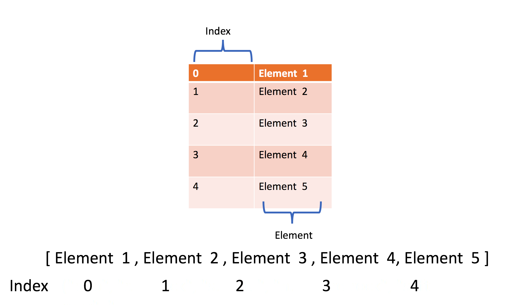
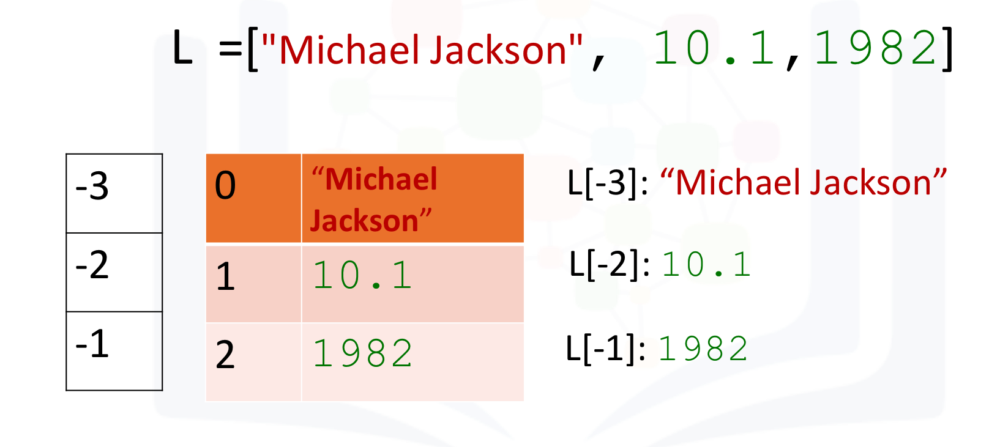
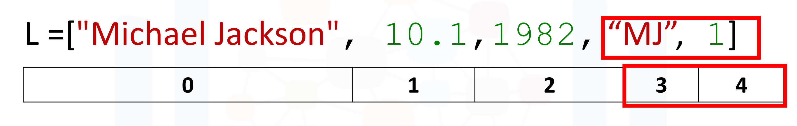
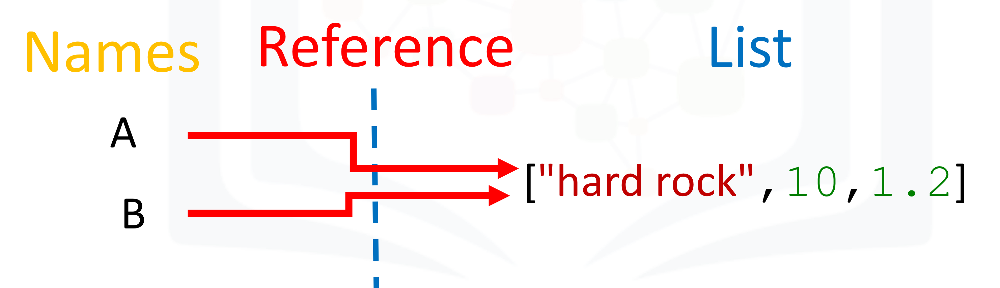
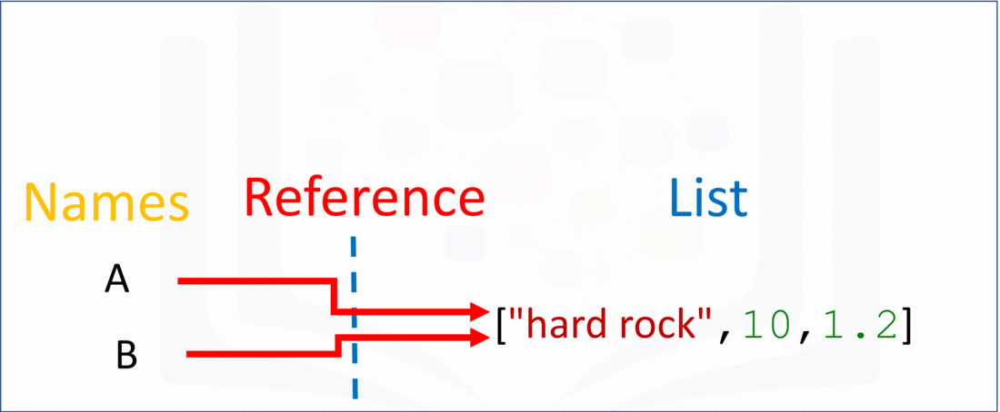

# 2.1.2 - Lists in Python

## Objectives

After completing this lab you will be able to:

- Perform list operations in Python, including indexing, list manipulation, and copy/clone list.

## Table of Contents

- [About the Dataset](#dataset)
- [Lists](#lists)
	- [Indexing](#indexing)
	- [List Content](#content)
	- [List Operations](#operations)
	- [Copy and Clone list](#copyclone)
- [Quiz on Lists](#quiz)
- [Scenario: Shopping List](#scenario)
## About the Dataset <a id = "dataset"></a>

Imagine you received album recommendations from your friends and complied all of the recommandations into a table, with specific information about each album.

The table has one row for each movie and several columns:
- **Artist** - Name of the artist
- **Album** - Name of the album
- **Released_year** - Year the album was released
- **Length_min_sec** - Length of the album (hours, minutes, seconds)
- **Genre**- Genre of the album
- **Music_recording_sales_millions** - Music recording sales (millions in USD) on [SONG://DATABASE](http://www.song-database.com/?utm_medium=Exinfluencer&utm_source=Exinfluencer&utm_content=000026UJ&utm_term=10006555&utm_id=NA-SkillsNetwork-Channel-SkillsNetworkCoursesIBMDeveloperSkillsNetworkPY0101ENSkillsNetwork19487395-2021-01-01)

- **Claimed_sales_millions** - Album's claimed slaes (millions in USD) on [SONG://DATABASE](http://www.song-database.com/?utm_medium=Exinfluencer&utm_source=Exinfluencer&utm_content=000026UJ&utm_term=10006555&utm_id=NA-SkillsNetwork-Channel-SkillsNetworkCoursesIBMDeveloperSkillsNetworkPY0101ENSkillsNetwork19487395-2021-01-01)

- **Released** - Date on which the album was released

- **Soundtrack** - Indicates if the album is the movie soundtrack (Y) or (N)

- **Rating_of_friends** - Indicates the rating from your friends from 1 to 10.

The Dataset can be seen below:

|Artist| Album| Released| Length| Genre| Music recording slaes (millions)| Claimed slaes (millions) | Released| Soundtrack| Rating (freinds)|
|---|---|---|---|---|---|---|---|---|---|
|Michael Jackson| Thriller| 1982| 00:42:19| Pop, rock, R&B| 46| 65| 30-Nov-82| | 10.0|
| AD/DC| Back in Black| 1980| 00:42:11| hard rock| 26.1| 50| 25-Jul-80| | 8.5|
|Pick Floyd| The Dark Side of the Moon| 1973| 00:42:49| Progressive rock| 24.2| 45| 01-Mar-73| | 9.5|
|Whitney Houston| The Bodyguard| 1992| 00:57:44| Soundtrack/R&B, soul, pop| 26.1| 50| 25-Jul-80|Y|7.0|
|Meat Loaf| Bat Out of Hell|1977| 00:46:33| Hard rok, progressive rock| 20.6| 43| 21-Oct-77| | 7.0|
|Eagles| Their Greatest Hits (1971-1975)|1976|00:43:08| Rock, soft rock, folk rock| 32.2| 42| 17-Feb-76| | 9.5|
|Bee Gees| Saturday Night Fever| 1977| 1:15:54| Disco| 20.6| 40| 15-Nov-77| Y | 9.0|
|Fleet wood Mac| Rumours| 1977| 00:40:01| Soft rock | 27.9| 40| 04-Feb-77| | 9.5|
## Lists <a id = "lists"></a>

### Indexing <a id= "indexing"></a>
We are going to take a look at lists in Python. A list is a sequenced collection of different objects such as integers, strings, and even other lists as well. The address of each element within a list is called an **index**. An index is used to access and refer to items within a list.



To create a list, type the list within square brackets [], with your content inside the parenthesis and separated by commas. Let us try it!

```python
# Create a list
>>> L = ['Michael Jackson', 10.0, 1982]
>>> L
['Michael Jackson', 10.0, 1982]
```
We can use negative and regular indexing with a list:



```python
# Print the elements on each index
>>> print('the same element using negative and positive indexing:\n Postive', L[0], '\n Negative:', L[-3])
the same element using negative and positive indexing:
 Postive Michael Jackson 
 Negative: Michael Jackson
>>> print('the same element using negative and positive indexing: \n Positive:', L[1], '\n Negative:', L[-2])
the same element using negative and positive indexing: 
 Positive: 10.0 
 Negative: 10.0
>>> print('the same element using negtive and positive indexing:\n Positive:', L[2], '\n Negative:', L[-1])
the same element using negtive and positive indexing:
 Positive: 1982 
 Negative: 1982
```
### List Content <a id = "content"></a>
Lists can contain strings, floats and integers. We can nest other lists, and we can also nest tuples and other data structures. The same indexing conventions apply for nesting:

```python
# Sample List
>>> L = ['Michael Jackson', 10.0, 1982, 1982, [1,2], ("A", 1)]
```

### List Operations <a id = "operations"></a>

We can also perform slicing in lists. For example, if we want the last two elements, we use the following command:

```python
>>> L = ['Michael Jackson', 10.0, 1982,"MJ", 1]
>>> L
['Michael Jackson', 10.0, 1982, 'MJ', 1]
```



```python
# List slicing
>>> L[3:5]
['MJ', 1]
```

We can use the mothod `extend` to add new elements to the list:

```python
# Use extend to add elements to list

>>> L = ['Michael Jackson', 10.0]
>>> L.extend(['pop', 10])
>>> L
['Michael Jackson', 10.0, 'pop', 10]
```

Another similar method is `append`. If we apply append instead `extend`, we add one element to the list:

```python
# Use append to add elements to list

>>> L = ['Michael Jackson', 10.0]
>>> L.append(['pop', 10])
>>> L
['Michael Jackson', 10.0, ['pop', 10]]
```

Each time we apply a method, the list changes. If we apply `extend` we add two new elements to the list. The list `L` is the nmodified by adding two new elements:

```python
>>> L = [ 'Michael Jackson', 10.0]
>>> L.extend(['pop', 10])
>>> L
['Michael Jackson', 10.0, 'pop', 10]
```

If we append the list `['a', 'b']` we have one new element consisting of a nested list:

```python
# Use append to add elements to list

>>> L.append(['a', 'b'])
>>> L
['Michael Jackson', 10.0, 'pop', 10, ['a', 'b']]
```

As lists are mutable, we can change them. For example, we can chagne the first element as follows:

```python
# Change the element based on the index

>>> A = ["disco", 10, 1.2]
>>> print('Before change:', A)
Before change: ['disco', 10, 1.2]
>>> A[0] = 'hard rock'
>>> print('After change:', A)
After change: ['hard rock', 10, 1.2]

```

We can also delete an element of a list using the `del` command:

```python
# Delete the element based on the index

>>> print('Before change:', A)
Before change: ['hard rock', 10, 1.2]
>>> del(A[0])
>>> print('After change:', A)
After change: [10, 1.2]
```

We can convert a string to a list using `split`. For example, the method `split` translates every group of characters separated by a space into an elemenet in a list:

```python

# Delete the element based on the index

>>> 'hard rock'.split()
['hard', 'rock']
```

We can use the split function to separate strings on a specific character which we call a **delimiter**. We pass the character we would like to split on into the argument, which in this case is a comma. The result is a list, and each element corresponds to a set of characters that have been separated by a comma:

```python
>>> 'A,B,C,D'.split(',')
['A', 'B', 'C', 'D']
```

### Copy and Clone list <a id = "copyclone"></a>

When we set one variable `B` equal to `A`, both `A` and `B` are referencing the same list in memory:

```python
>>> A = ['hard rock', 10, 1.2]
>>> B = A
>>> print('A:', A)
A: ['hard rock', 10, 1.2]
>>> print('B:', B)
B: ['hard rock', 10, 1.2]
```


Initially, the value of the first element in **B** is set as 'hard rock'. If we change the first element in **A** to "banana", we get an unexpected side effect. As **A** and **B** are referencing the same list, if we chagne list **A**, the list **B** also changes. If we check the first element of **B** we get "banaba" instead of "Hard rock":
```python
>>> A = ['hard rock', 10, 1.2]
>>> B = A
>>> print('B[0]', B[0])
B[0] hard rock
>>> A[0] = "banana"
>>> print('B[0]', B[0])
B[0] banana
```

This is demonstrated in the following figure:



You can clone list **A** by using the following syntax:

```python
# Clone (clone by value) the list A

>>> B = A[:]
>>> B
['banana', 10, 1.2]
```

Now if you change **A**, **B** will not change:

```python
>>> print('B[0]', B[0])
B[0] banana
>>> A[0] = 'hard rock'
>>> print('B[0]', B[0])
B[0] banana
```

## Quiz on Lists <a id = "quiz"></a>

Create a list `a_list`, with the following element `1`, `hello`, `[1,2,3]`, and `True`.

```python
a_list=[1, 'hello', [1,2,3], True]
>>> a_list
[1, 'hello', [1, 2, 3], True]
```

>>> a_list[1]
'hello'

Retrieve the elements stored at index 1, 2, and 3 of `a_list`

```python
>>> a_list[1:4]
['hello', [1, 2, 3], True]
```

Concatenate the following lists `A = [1, 'a']` and `B = [2, 1, 'd']`:

```python
>>> A = [1, 'a']
>>> B = [2, 1, 'd']
>>> C = A + B
>>> C
[1, 'a', 2, 1, 'd']
```

<center> 

## Scenario: Shopping List  
</center> <a id = "scenario"></a>

### Task-1 Create an empty list

At first we need to create a empty list for storing the items to buy in Shopping list.

```python
shoppingList = []
```

### Task-2 Now store the number of items to the shopping_list

```python
>>> shoppingList.extend(['Watch', 'Laptop', 'Shoes', 'Pen', 'Clothes'])
>>> shoppingList
['Watch', 'Laptop', 'Shoes', 'Pen', 'Clothes']
```

### Task-3 Add a new item to the shopping_list

Seems like I missed one item "Football" to add in the shopping list.

```python
>>> shoppingList.append('Football')
>>> shoppingList
['Watch', 'Laptop', 'Shoes', 'Pen', 'Clothes', 'Football']
```
### Task-4 Print First item from the shopping_list

Let's check the first item that we need to buy.

```python
>>> print(shoppingList[0])
Watch
```

### Task-5 Print Last item from the shopping_list

let's check the last time that we need to buy

```python
>>> print(shoppingList[-1])
Football
```

### Task-6 Print the entire Shopping List

```python
>>> print(shoppingList)
['Watch', 'Laptop', 'Shoes', 'Pen', 'Clothes', 'Football']
```

### Task-7 Print the item that are important to buy from the Shopping List.

```python
>>> print(shoppingList[1:3])
['Laptop', 'Shoes']
```

### Task-8 Changethe item from the shooping list

Instead of "pen" i want to buy 'notebook" let's change the item stored in the list

```python
>>> shoppingList[3] = "Notebook"
>>> shoppingList
['Watch', 'Laptop', 'Shoes', 'Notebook', 'Clothes', 'Football']
```

### Task-9 Delete the item from the shopping_list that is note required

Let's delete items that are unimportant, such as; I don't want to buy 'Clothes', let's delete it

```python
>>> del(shoppingList[4])
>>> shoppingList
['Watch', 'Laptop', 'Shoes', 'Notebook', 'Football']
```


### Taks 10 - Print the shopping list

We are ready with our shopping list

```python
>>> print(shoppingList)
['Watch', 'Laptop', 'Shoes', 'Notebook', 'Football']
```
