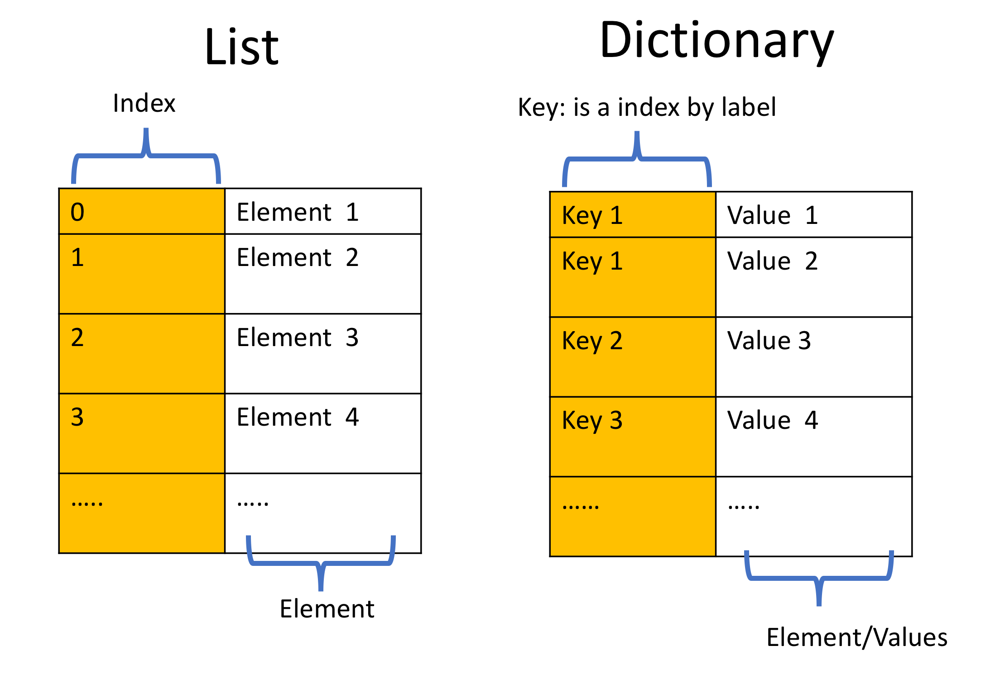
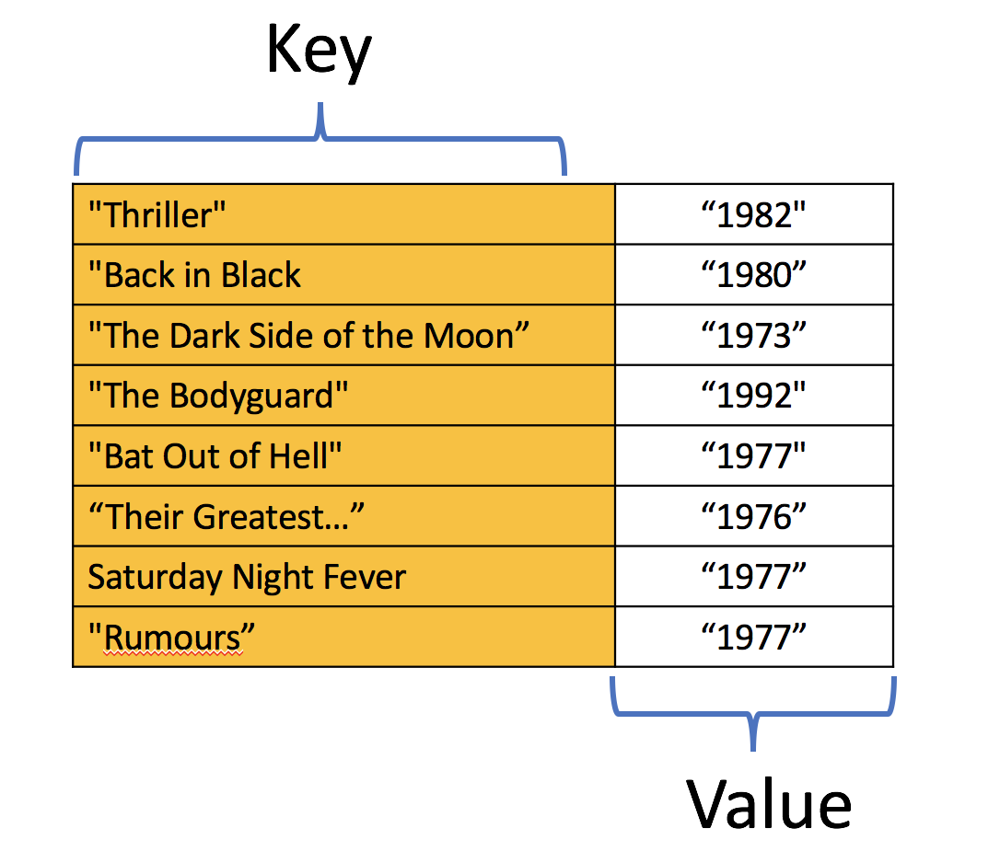
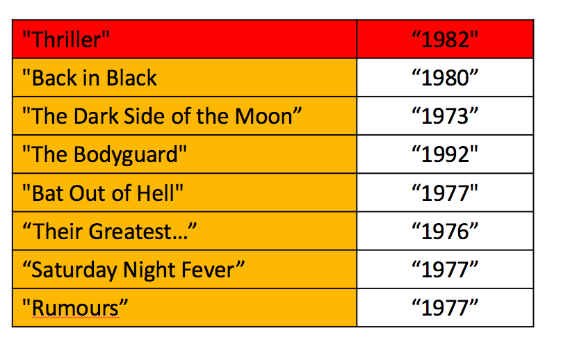
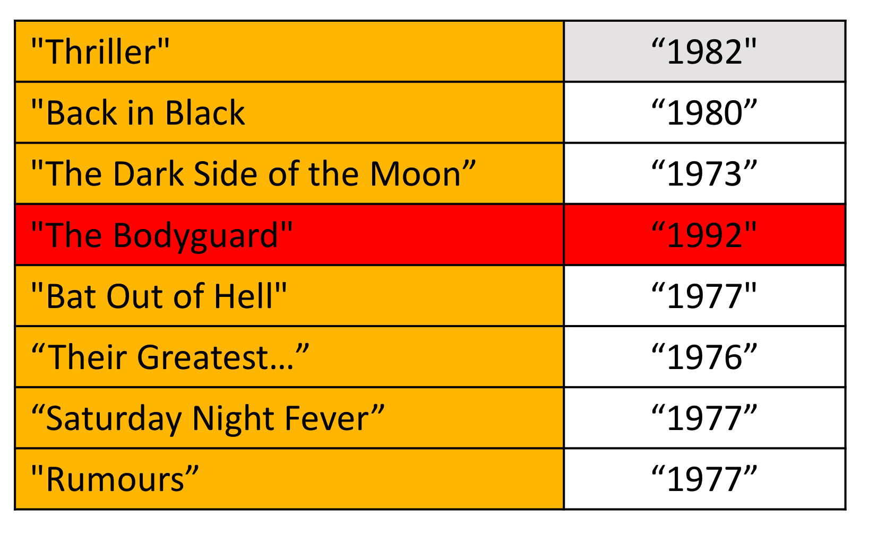

# 2.2.2 Dictionaries in Python

## Objectives

After completing this lab you will be able to:
- Create a Dictionary and perform operations on the Dictionary

## Table of Contents

- Dictionaries
	- What are Dictionaries
	- Keys

- Quiz on Dictionaries
- Scenario

## Dictionaries

### What are Dictionaries

A dictionary consists of keys and values. It is helpful to compare a dictioanry to a list. Instead of being indexed numerically like a list, dictionaries have keys. These keys are the keys that are used to access values within a dictionary.

The best example of a dictionary can be accessing person's detais using the **social securiry number**.

Here the social security number which is a unique will be the **key** and the details of the people will be the **values** associated with it.



### Create a Dictionary and access the elements

An example of a Dictioanry `Dict`: Here we are creating a dictioanry named **Dict** with he following details:

- Keys are **key1, key2, key3, key4, key5**
- Values are `{1, 2, [3,3,3], (4, ,4 ,4), 5, (1, 0): 6}`

```python
>>> Dict = {'key1':1, 'key2': '2', 'key3': [3, 3, 3], 'key4': (4, 4, 4), ('key5'): 5, (0, 1): 6}
>>> Dict
{'key1': 1, 'key2': '2', 'key3': [3, 3, 3], 'key4': (4, 4, 4), 'key5': 5, (0, 1): 6}
```

The keys can be strings:

```python
# Access to the value by the key
>>> Dict['key1']
1
```

Keys can also be any immutable object such as a tuple: 

```python
>>> Dict[(0,1)]
6
```

Each key is separated from its value by a colon "`:`". Commas separate the items, and the whole dictioanry is enclosed in curly braces. An empty dictionary without any items is written with just two curly braces, like this `{}`:

```python
# Create a sample dictionary

>>> release_year_dict = {'Thriller': '1982', 'Back in Black': '1980', 'The Dark Side of the Moon': '1973', 'The Bodyguard': '1992', 'Bat Out of Hell': '1977', 'Their Greatest Hits (1971-1975)': '1976', 'Saturday Night Fever': '1977',  'Rumours': '1977'}
>>> release_year_dict
{'Thriller': '1982', 'Back in Black': '1980', 'The Dark Side of the Moon': '1973', 'The Bodyguard': '1992', 'Bat Out of Hell': '1977', 'Their Greatest Hits (1971-1975)': '1976', 'Saturday Night Fever': '1977', 'Rumours': '1977'}
```

In summary, like a list, a dictionary holds a sequence of elements. Each element is represented by a key and its corresponding value. Dictionaries are created with two curly braces containing keys and values separated by a colon. For every key, there con only be one single value, however, multiple keys can hold the same value. Keys can only be strings, numbers, or tuples, but values can be any data type.

It is helpful to visualize the dictionary as a table, as in the following image. The first column represents the keys, the second column represents the values.



### Keys

You can retrive the values based on the names:

```python
>>> release_year_dict['Thriller']
'1982'
```

This corresponds to:



Similarly for **The Bodyguard**


```python
>>> release_year_dict['The Bodyguard']
'1992'
```


Now let us retrive the keys of the dictionary using the method `keys()`:

```python
# Get all the keys in dictionary

>>> release_year_dict.keys()
dict_keys(['Thriller', 'Back in Black', 'The Dark Side of the Moon', 'The Bodyguard', 'Bat Out of Hell', 'Their Greatest Hits (1971-1975)', 'Saturday Night Fever', 'Rumours'])

```

You can retrive the values using the method `values()`:

```python
>>> release_year_dict.values()
dict_values(['1982', '1980', '1973', '1992', '1977', '1976', '1977', '1977'])
```

We can add an entry:

```python
# Append value with key into dictionary

>>> release_year_dict['Graduation'] = '2007'
>>> release_year_dict
{'Thriller': '1982', 'Back in Black': '1980', 'The Dark Side of the Moon': '1973', 'The Bodyguard': '1992', 'Bat Out of Hell': '1977', 'Their Greatest Hits (1971-1975)': '1976', 'Saturday Night Fever': '1977', 'Rumours': '1977', 'Graduation': '2007'}
```

We can delete an entry:

```python
# Delete entries by key

>>> del(release_year_dict['Thriller'])
>>> del(release_year_dict['Graduation'])
>>> release_year_dict
{'Back in Black': '1980', 'The Dark Side of the Moon': '1973', 'The Bodyguard': '1992', 'Bat Out of Hell': '1977', 'Their Greatest Hits (1971-1975)': '1976', 'Saturday Night Fever': '1977', 'Rumours': '1977'}
```

We can verify if an element is in the dictionary:

```python
# Verify the key is in the dictionary

>>> 'The Bodyguard' in release_year_dict
True
```

## Quiz on Dictionaries

You will need this dictionary for the text two questions:

```python
# Question sample dictionary

>>> soundtrack_dict = {'The Bodyguard': '1992', 'Saturday Night Fever': '1977'}
>>> soundtrack_dict
{'The Bodyguard': '1992', 'Saturday Night Fever': '1977'}
```

1. In the dictionary `soundtrack_dic` what are the keys?

```python
>>> soundtrack_dict.keys()
dict_keys(['The Bodyguard', 'Saturday Night Fever'])
```

2. In the dictionary `soundtrick_dict` what are the values?

```python
>>> soundtrack_dict.values()
dict_values(['1992', '1977'])
```

You will need this dictionary for the following question:

The Albums **Back in Back**, **The Bodyguard**, and **Thriller** have the following music recording sales in millions 50, 50, and 65 respectively:

1. Create a dictionary `album_sales_dict` where the keys are the album name and the sales in millions are the values.

```python
>>> album_sales_dict = {'The Bodyguard': 50, 'Back in Black':50, 'Thriller': 65}
>>> album_sales_dict
{'The Bodyguard': 50, 'Back in Black': 50, 'Thriller': 65}
```

2. Use the dictionary to find the total sales in **Thriller**:

```python
>>> album_sales_dict['Thriller']
65
```

3. Find the names of the albums from the dictionary using the method `keys()`:

```python
>>> album_sales_dict.keys()
dict_keys(['The Bodyguard', 'Back in Black', 'Thriller'])
```

4. Find the values of the recording sales from the dictionary using the method `values`:

```python
>>> album_sales_dict.values()
dict_values([50, 50, 65])
```

## Scenario: Inventory Store

The inventory store scenario project jutilizes a dictionary-based approach to develop a robust system for managing and trcking inventory in a retail store. **Note:-You will be working with two product details**.

### Task-1 Create an empty dictionary

First you need to create an empty dictionary, where you will be storing the product details.

```python
inventory = {}
```

### Task-2 Store the first product details in variable

- Product Name = Mobile phone
- Product Quantity = 5
- Product price = 20000
- Product Release Year = 2020

```python
>>> productName = 'Mobile phone'
>>> productQuantity = 5
>>> productPrice = 20000
>>> productReleaseyear = 2020
```

### Task-3 Add the details in inventory 

>>> inventory['product name'] = productName
>>> inventory['product quantity'] = productQuantity
>>> inventory['product price'] = productPrice
>>> inventory['product release year'] = productReleaseyear
>>> inventory
{'product name': 'Mobile phone', 'product quantity': 5, 'product price': 20000, 'product release year': 2020}

### Task-4 Store the second product details in a variable

