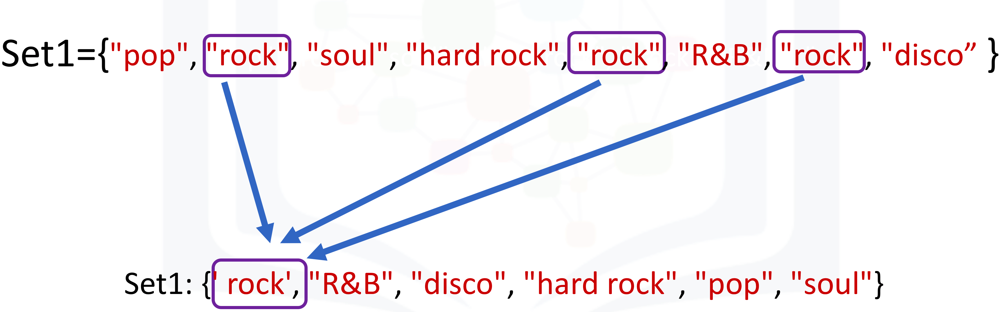

# 2.3.2 Sets in Python

## Objectives

After completing this lab you will be able to:

- Work with sets in Python, including operations and logic operations.

## Table of Contents

- Sets 
	- Set Content
	- Set Operations
	- Sets Logic Operations

- Quiz on Sets

## Sets

### Set Content

A set is a unique collection of objects in Python. You can denote a set with a pair of curly brackets `{}`. Python will automatically remove duplicate items:

```python
>>> set1 = {'pop', 'rock', 'soul','hard rock', 'rock', 'rock', 'pop'}
>>> set1
{'rock', 'hard rock', 'soul', 'pop'}
```

The process of mapping is illustrated in the figure:



You can also create a set from a list as follows:

```python
>>> album_list = ['Rose', 'APT',  2024, '00:03:22', 'Pop', 'R&B', '11-Nov-24', 9.5]
>>> album_set = set(album_list)
>>> album_set
{'11-Nov-24', 2024, '00:03:22', 9.5, 'R&B', 'APT', 'Pop', 'Rose'}
```

Now let us create a set of genres:

```python
>>> music_genres =  set(['pop', 'pop', 'rock', 'folk rock', 'hard rock', 'soul', 'progressive rock', 'soft rock', 'R&B', 'disco'])
>>> music_genres
{'rock', 'progressive rock', 'hard rock', 'soul', 'soft rock', 'R&B', 'pop', 'disco', 'folk rock'}
```

## Set Operations

Let us go over set operations, as these can be used to change the set. Consider the set **A**:

```python
# Sample set

>>> A = set(['APT', 'Born Pink', 'Drip'])
>>> A
{'Born Pink', 'Drip', 'APT'}
```

We can add an element to a set using the `add()` method:

```python
# Add element to set

>>> A.add('Sheet')
>>> A
{'Sheet', 'Born Pink', 'Drip', 'APT'}
```

If we add the same element twice, nothing will happen as there can be no duplicates in a set:

```python
# Try to add duplicate element to the set

>>> A.add('Sheet')
>>> A
{'Sheet', 'Born Pink', 'Drip', 'APT'}
```

We can remove an item from a set using the `remove` method:

```python
# Remove the element from set

>>> A.remove('Born Pink')
>>> A
{'Sheet', 'Drip', 'APT'}
```

We can verify if an element is in the set using the `in` command:

```python
# Verify if the element is in the set

>>> 'Sheet' in A
True
```
### Sets Logic Operations

Remember that with sets you can check the difference between sets, as well as the symmetric difference, intersection, and union:

Consider the following two sets:

```python
>>> album_set1 = set(['drip', 'sheet', 'apt'])
>>> album_set2 = set(['drip', 'sheet' ,'flowers'])
>>> album_set1, album_set2
({'sheet', 'apt', 'drip'}, {'sheet', 'drip', 'flowers'})
```

As both sets contain `drip` and `sheet`. You can find the intersect of two sets as follow using `&`:

```python
# Find the intersections

>>> intersection = album_set1 & album_set2
>>> intersection
{'sheet', 'drip'}
```

You can find all the elements that are only contained in `album_set1` using the `difference` method:

```python
# Find the difference in set1 but not set2

>> intersection
{'sheet', 'drip'}
>>> album_set1.difference(album_set2)
{'apt'}
```

You only need to consider elements in `album_set1`; all the elements in `album_set2`, including the intersection, are not included.

The elements in `album_set2` but not in `album_set1` is given by:

```python
>>> album_set2.difference(album_set1)
{'flowers'}
```

You can also find the intersection of `album_list1` and `album_list2`, using the `intersection` method:

```python
# Use intersection method to find the intersection of album_list1 and album_list2

>>> album_set1.intersection(album_set2)
{'sheet', 'drip'}
```

This corresponds to the intersection of the two circles:

The union corresponds to all the elements in both sets, which is represented by coloring both circles:

The union is given by:

```python
# Find the union of two sets

>>> album_set1.union(album_set2)
{'apt', 'sheet', 'drip', 'flowers'}
```

And you can check if a set is a superset or subset of another set, respectively, like this:

```python
# Check if superset

>>> set(album_set1).issuperset(album_set2)
False
```

```python
# Check if subset

>>> set(album_set1).issubset(album_set2)
False
```

Here is an example where `issubset()` and `issuperset()` return true:

```python
# Check if subset

>>> album_set1
{'sheet', 'apt', 'drip'}
>>> {'sheet', 'apt'}.issubset(album_set1)
True
```

```python
# Check if superset

>>> album_set1.issuperset({'sheet', 'apt'})
True
```

## Quiz on Sets 

Convert the list `['rap', 'house', 'electronic music', 'rap']` to a set:

```python

>>> album_set = set(['rap', 'house', 'electronic music', 'rap'])
>>> album_set
{'rap', 'electronic music', 'house'}
```

Consider the list `A = [1, 2, 2, 1]` and set `B = set([1, 2, 2, 1])` does `sum(A) == sum(B)`?


```python
>>> A = [1, 2, 2, 1] 
>>> B = set([1, 2, 2, 1])
>>> sum(A)
6
>>> sum(B)
3
>>> B
{1, 2}
>>> sum(A) == sum(B)
False
```

Create a new set `album_set3` that is the union of `album_set1` and `album_set2`:

```python

>>> album_set1 = set(['sheet', 'drip', 'apt'])
>>> album_set2 = set(['apt', 'drip', 'flower'])
>>> album_set3 = album_set1.union(album_set2)
>>> album_set3
{'apt', 'flower', 'sheet', 'drip'}
```

Find out if `album_set1` is a subset of `album_set3`:

```python
>>> album_set1.issubset(album_set2)
False
```
