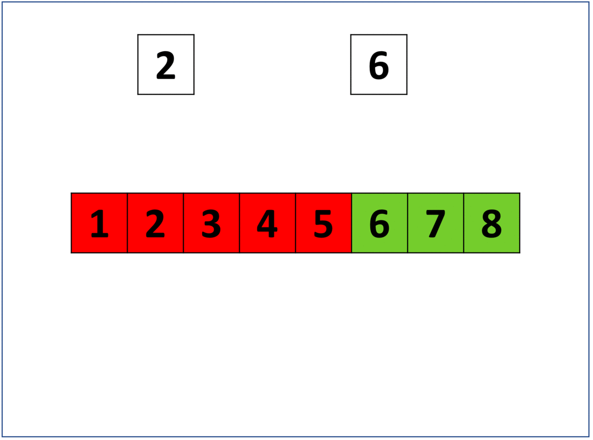
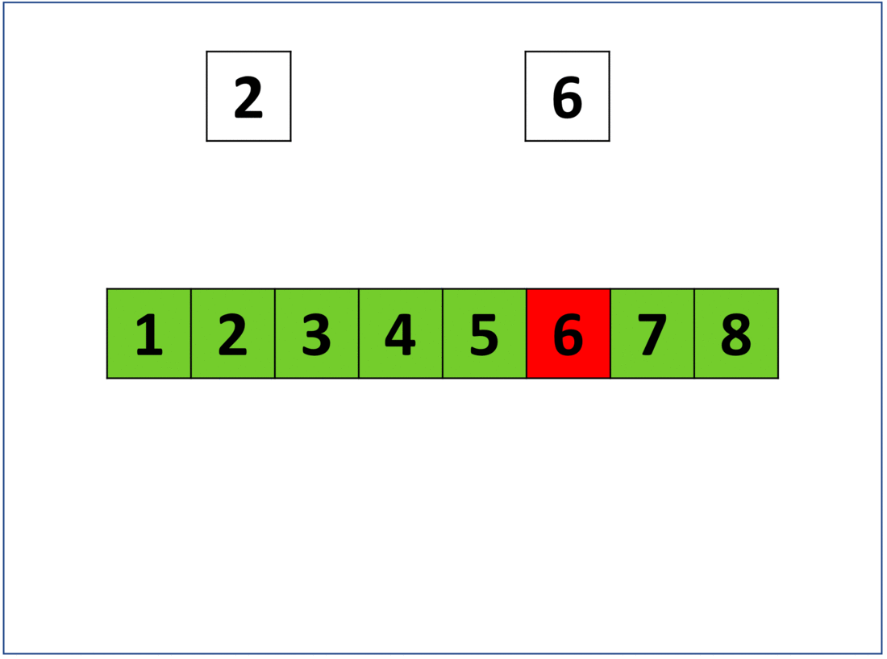
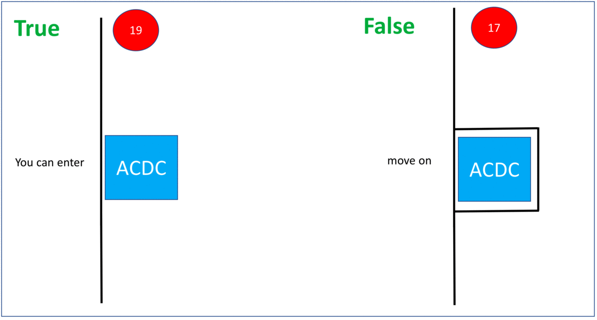
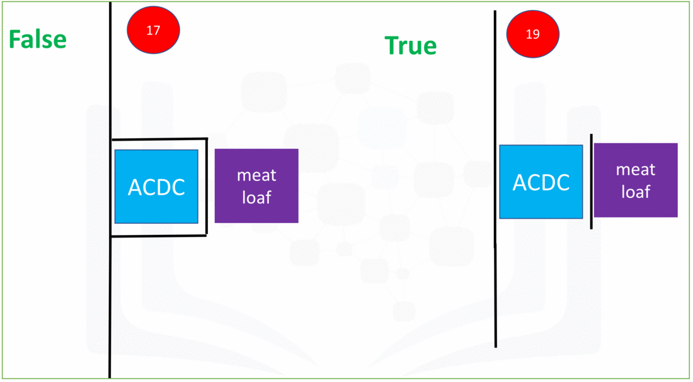
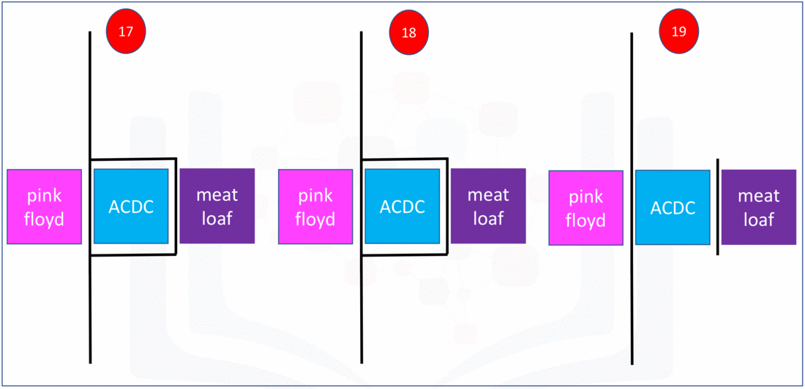
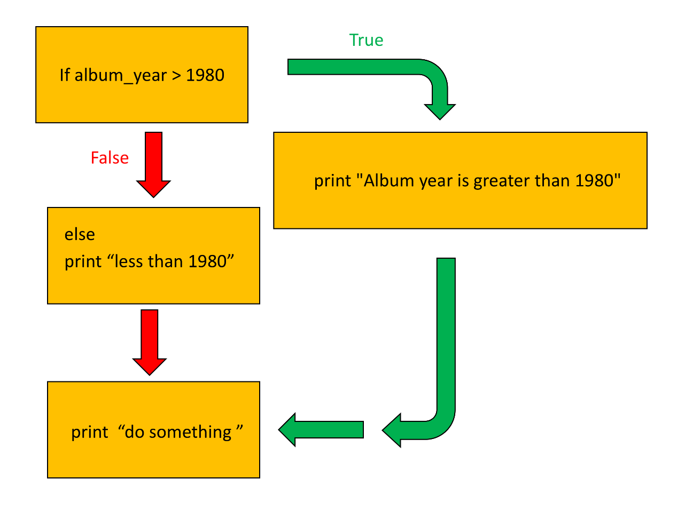
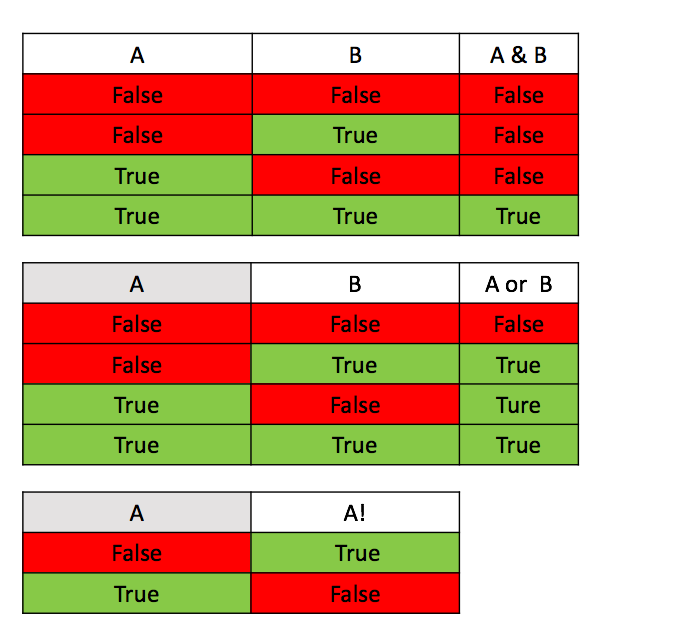
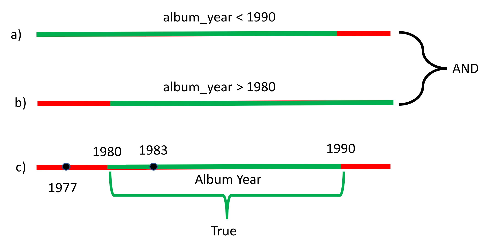
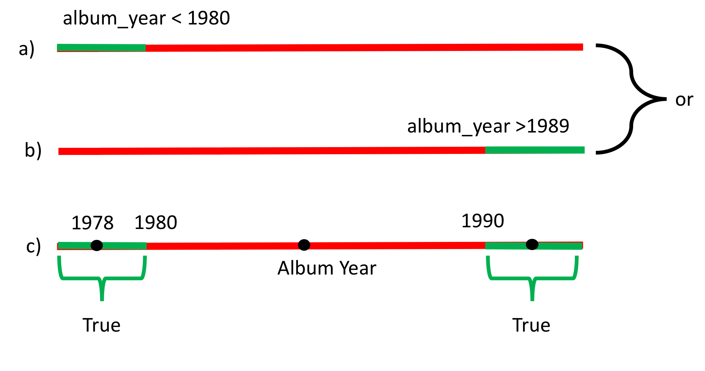

# 3.1.2 - Conditions in Python

## Objectives:

After completing this lab you will be able to:

- work with condition statements in Python, including operators, and branching.

## Table of Contents

- Condition Statements
	- Comparison Operators
	- Branching
	- Logical operators

- Quiz on Condition Statement

## Condition Statements

### Comparison Operators

Comparison operations compare some value or operand and based on a condition, produce a Boolean. When comparing two values you can use these operators: 

- equal `==`
- not equal `!=`
- greater than `>`
- less than `<`
- greater than or equal to `>=`
- less than or equal to `<=`

Let's assign `a` a value of 5. Use the quality operator denoted with two equal `==` signs to determine if two values are equal. The case below compares the variable `a` with 6.

```python
# Condition Equal

>>> a = 5
>>> a == 6
False

```

The result is `False`, as 5 does not equal to 6.

Consider the following equality comparison operator: `i > 5`. If the value of the left operand, in this case the variable `i`, is greater than the value of the right operand, in this case 5, then the statement is `True`. Otherwise, the statement is `False`. If `i` is equal to 6, because is larger than 5, the output is `True`.

```python
>>> i = 6
>>> i > 5
True
```

Set `i = 2`. The statement is False as 2 is not greater than 5:

```python
>>> i = 2 
>>> i > 5
False
```

Let's display some values for `i` in the figure. Set the values greater than 5 in green and the rest in red. The green region represents where the condition is `True`, the red where the statement is `False`. If the value of `i` is 2, we get `False` as the 2 falls in the red region. Similarly, if the value for `i` is 6 we get a `True` as the condition falls in the green region.

	

The inequality test uses an exclmation mark preceding the equal sign, if two operands are note equal then the condition becomes `True`. For example, the following condition will produce `True` as long as the values of `i` is not equal to 6:

```python
>>> i = 2
>>> i != 6
True
```

See the number line below. When the condition is `True`, the corresponding numbers are marked in green and for where the condition is `False` the corresponding number is marked in red. If we set `i` equal to 2 the operator is true, since 2 is in the green region. If we set `i` equal to 6, we get a `False`, since the condition falls in teh red region.



We can apply the same methods on strings. For example ,we can use an equality for operator on two different strings. As the strings are not equal, we get a `False`.

```python
# Use Equality sign to compare the strings

>>> 'ABCD' == 'Rose'
False
```

If we use the inequality operator, the output is going to be `True` as the strings are not equal.

```python
# Use Inequality sign to compare the strings

>>> 'ABCD' != 'Rose'
True
```

The inequality operation is also used to compare the letters/words/sumbols according to the ASCII value of letters. The decimal value shown in the following table represents the orther of the character:

| Char| ASCII| Char | ACCII| Char| ASCII| Char| ASCII|
|---|---|---|---|---|---|---|---|
|A | 65| N| 78| a| 97| n| 110 |
|B | 66| O | 79| b| 98| o| 111|
|C | 67| P| 80| c| 99| p| 112|
|D| 68| Q| 81| d| 100| q | 113|
|E | 68| R| 82| e| 101| r| 114|
|F| 70| S | 83| f| 102| s| 115|
|G| 71 | T| 84| g| 103| t | 116|
|H| 72 | U| 85| h| 104| u| 117|
|I| 73| V| 86| i|105| v| 118|
|J| 74| W| 87| j| 106| w| 119|
|K| 75| X| 88| k| 107| x| 120|
|L| 76| Y| 89| i| 108| y| 121|
|M| 77| Z| 90| m| 109| z| 122|

For example, the ASCII code for `!` is 33, while the ASCII code for `+` is 45. Therefore `+` is larger than `!` as 45 is greater than 33.

Similarly, from the table above we see that the value for `A` is 65, and the value for `B` is 66, therefore:

```python
# Compare characters

>>> 'B' > 'A'
True
```

When there are multiple letters, the first letter takes precedence in ordering:

```python
>>> 'BA' > 'AB'
True
```

**Note** Upper Case Letters have different ASCII code than Lower Case Letters, which means the comparison between the letters in Python in case-sensitive.

### Branching

Branching allows us to run different statements for different inputs. It is helpful to think of an `if statement` as a locked room. if the statement is `True` we can enter the room and your program will run some predefined tasks, but if the statement is `False` the program will ignore the task.

For example, consider the blue rectangle representing an ACDC concert. If the individual is older than 18, they can enter the ACDC concert. If they are 18 or younger, they cannot enter the concert.

We can use the condition statements learned before as the conditions that need to be checked in the `if statement`. The syntax is as simple as `if condition statement : ` which contains a word `if`, any conidtion statement, and a colon at the end. Start your tasks which need to be executed under this condition in a new line with an indent. The lines of code after the colon and with an indent will only be executed when the `if statement` is `True`. The tasks will end when the line of code does not contain the indent.

In the case below, the code `print('you can enter')` is executed only if the variable `age` is greater than 18 is a True case because this line of code hast he indent. However, the executio of `print('move on')` will not be influenced by the if statement.

```python
# If statement example

age = 19
#age = 18

#expression that can be true or false
if age > 18:
    
    #within an indent, we have the expression that is run if the condition is true
    print("you can enter" )

#The statements after the if statement will run regardless if the condition is true or false 
print("move on")
```

*Try uncommenting the age variable*

It is helpful to use the following diagram to illustrate the process. On the left side, we see twhat happens when the condition is `True`. The person enters the ACDC concert representing the code in the indent being executed; they then move on. On the right side, we see that happens when the conidtion is `False`; the person is not granted access and the person moves on. In this case, the segment of code in the indent does not run, but the rest of the statements are run.



The `else` statement runs a block of code if none of the conditions are `True` statement. Let's use the ACDC concert analogy agaiin. If the user is 17 they cannot go to the ACDC concert, but they can go to the Meatloaf concert. The syntax of the `esle` statement is similar as the syntax of the `if` statement, as `else :`. Notice that, there is no condition statement for `else`. Try changing the values of `age` to see what happens:

```python
>>> age = 18
>>> 
>>> if age > 18:
...     print('you can enter')
... else:
...     print('go see Meat Loaf')
... 
go see Meat Loaf
>>> print('move on')
move on
```

The process is demonstrated below, where each of the possibilities is illustrated on each side of the image. On the left is the case where the age is 17, we set the variable age to 17, and this corresponds to the individual attending the Meatloaf concert. The right portion shows what happens when the individual is over 18, in this case 19, and the individual is granted access to the concert.



The `elif` statement, short for else if, allows us to check additional conditions if the condition statements before it are `False`. If the condition for the `elif` statement is `True`, the alternate expressions will be run. Consider the concert example, where if the individuals is 18 they will go to the Pink Floyd concert instead of attending the ACDC or Meat-loaf concert. A person that is 18 years of age enters the area, and as they are not older than 18 they can not see ACDC, but since they are 18 years of age, they attend Pink Floyd. After seeing Pink Floyd, they move on. The syntax of the `elif` statement is similar in that we merely change the `if` in the `if` statement to `elif`.

```python
>>> age = 18
>>> 
>>> if age > 18:
...     print('you can enter')
... elif age == 18:
...     print('go see Pink Floyd')
... else:
...     print('go see Meat Loaf')
... 
go see Pink Floyd
>>> print('move on')
move on
```

The three combinations are shown in the figure below. The left-most region shows what happens when the individual is less than 18 years of age. The central component shows when the individual is exactly 18. The rightmost shows when the individual is over 18.



Look at the following code:

```python
>>> album_year = 1983
>>> album_year = 1970
>>> 
>>> if album_year > 1980:
...     print('Album year is greater than 1980')
... 
>>> print('do something')
do something
```

Feel free to change `album_year` value to other values -- you'll see that the result changes!

Notice that the code in the above **indented** block will only be executed if the results are **True**.

As before, we can add an `else` block to the `if` block. The code in the `else` block will only be executed if the result is `False`.

**Syntax**

```python
if condition:
	#do something 
else:
	# do something else
```

If the condition in the `if` statement is `False`, the statement after `else` block will execute. This is demonstrated in the figure:



```python
>>> album_year = 1983
>>> 
>>> if album_year > 1980:
...     print('Album year is greater than 1980')
... else:
...     print('less than 1980')
... 
Album year is greater than 1980
>>> print('do something')
do something
```

Fell free to chagne the `album_year` value to other values -- you'll see that the result chagnes based on it!

### Logical operators

Sometimes you want to check more than one condition at once. For example, you might want to check if one condition and another condition are both `True`. Logical operators allow you to combine or modify conditions.

- `and`
- `or`
- `not`

These operators are summarized for two variables using the following truth tables:



The `and` statement is only `True` when both conditions are true. The `or` statement is True if one condition, or both are `True`. The `not` statement outputs the opposite truth value.

Let's see how to determine if an album was released after 1979( 1979 is not included and before 1990) (1990 is not included). The time periods between 1980 and 1989 satisfy this condition. This is demonstrated in the figure below. The green on lines `a` and `b` represents where both conditions are `True`, this corresponds to where the green regions overlap.



The block of code to perform thhis check is given by:

```python
>>> album_year = 1980
>>> 
>>> if (album_year > 1979) and (album_year < 1990): 
...     print('Album year was in between 1980 and 1989')
... 
Album year was in between 1980 and 1989
>>> print('')

>>> print('Do Stuff')
Do Stuff
```

To determine if an album was released before 1980 ( 1979 and earlier) or after 1989 (1990 and onward), and or statement can be used. Periods before 1980 (1979 and earlier) or after 1989 (1990 and onward) satisfy this condition. This is demonstrated in the following figure, the color green in **a** and **b** represents periods where the statement is true. The color green in **c** represents where at least one of the conditions are true.



The block of code to perform this check is given by:

```python
>>> album_year = 1990
>>> 
>>> if(album_year < 1980) or (album_year > 1989):
...     print('Album was not made in the 1980s')
... else:
...     print('The album was made in the 1980s')
... 
Album was not made in the 1980s
```

## Practise Excercises

1. There are 2 sisters, Annie and Jane, born in 1996 and 1999 respectively. They want to know who was born in a leap year. Write an if-else statement to determine who was born in a leap year.

> A leap year is one that is divisible by 4

```python
>>> Annie_birth = 1996
>>> Jane_birth = 1999
>>> if Annie_birth % 4 == 0:
...     print('Annie was born in leap year')
... elif Jane_birth % 4 == 0:
...     print('Jane was born in leap year')
... else:
...     print('Nobody was born in leap year')
... 
Jane was born in leap year
```

2. In a school canteen, children under the age of 9 are only given milk porridge for breakfast. Children from 10 to 14 are given a sandwhich, and children from 15 to 17 are  given a burger. The canteen master asks the age of the student and gives them breakfast accordingly. Sam's age is 10. Use if-else statement to determine what the canteen master will offer to him

```python
age = 14

if age <= 9:
	print('you will get a bowl of porridge!')
elif: age >= 10 and age <= 14:
	print('you will get a sandwich')
elif: age >= 15 and age <= 17:
	print('You will get a burger!')
```