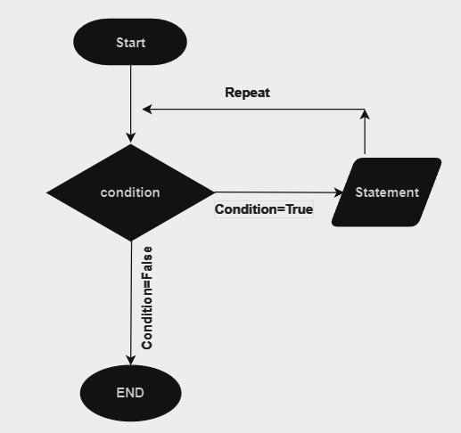

# 3.2.2 - Introduction to Loops in Python

## Objectives

1. Understand Python loops
2. How the loop Works
3. Learn about the needs for loop 
4. Utilize Python's Range function.
5. Familiarize with Python's enumerate function.
6. Apply while loops for conditional tasks.
7. Distinguish appropriate loop selection.

## What is a Loop?

In programming, a loop is like a magic trick that allows a computer to do something over and over again. Imagine you are a magician's assistant, and you magician friend asks you to pull a rabbit out of a hat, but not just once - they want you to keep doing it until they tell you to stop. That is what loops do for computers - they repeat a set of instructions as many times as needed.

## How Loop works?

Here's how it works in Python:



- `Start`: The for loop begins with the keyword for, followed by a variable that will take on each value in a sequence.
- `Condition`: After the variable, you specify the keyword in and a sequence, such as a list or a range, that the loop will iterate through.
- If `Condition True`:

1. The loop takes the first value from the sequence and assigns it to the variable.
2. The indented block of code following the loop header is executed using this value.
3. The loop then moves to the next value in the sequence and repeats the process until all values have been used.

**Statement**: Inside the indented block of the loop, you write the statements that you want to repeat for each value in the sequence.

**Repeat**: The loop continues to repeat the block of code for each value in the sequence until there are no more values left.

If **Condition False**:

1. Once all values in the sequence have been processed, the loop terminates automatically.
2. The loop completes its execution, and the program continues to the next statement after the loop.

## The Need for Loops

Think about when you need to count from 1 to 10. Doing it manually is easy, but what if you had to count to a **million**? Typing all those numbers one by one would be a nightmare! This is where loops come in handy. They help computers repeat tasks quickly and accurately without getting tired.

## Main Types of Loops

### For Loops

For loops are like a superhero's checklist. A for loop in programming is a control structure that allows the repeated execution of a set of statements for each item in a sequence, such as elements in a list of numbers in a range, enabling efficient iteration and automation of tasks

#### Syntax of for loop

```python
for val in sequence:
	# statement(s) to be executed in sequence as a part of the loop.

```

Here is an example of For loop.

Imagine you're a painter, and you want to paint a beautiful rainbow with seven colors. Instead of picking up each color one by one and painting the rainbow, yoiu could tell a magical painter's assistant to do it for you. This is what a basic for loop does in programming.

#### We have a list of colours.
```python
colors = ['red' , 'orange', 'yellow', 'green' , 'blue', 'indigo', 'violet']
```

#### Let's print the colour name in the new line using for loop

```python
for color in colors:
	print(color)
```

In this example, the for loop picks each color from the colors list and prints it on the screen. You don't have to write the same for each color - the loop does it automatically!

Sometimes you do not want to paint a rainbow, but **you want to count the number of steps** to **reach your goal**. A range-based for loop is like having a friendly step counter that helps you each your target.

Here is how you might use a for loop to count from 1 to 10:

```python
for number in range(1, 11):
	print(number)

```

Here, the `range(1, 11)` generates a sequence from 1 to 10, and the for loop goes through each number in that sequence, printing it out. It's like taking 10 steps, and you're guided by the loop!

## Range Function

The range function in Python generates an ordered sequence that can be used in loops. It takes one or two arguments:

	If given one argument( e.g., range(11)), it generates a sequence starting from 0 up to (but not including) the given number.

```python
for number in range(11):
	print(nubmer)

```

	If given two arguments(e.g., range(1,11)), it generates a sequence starting from the first argument up to (but not including) the second argument.

```python
for number in range(1, 11):
	print(number)
```
### The Enumerated For Loop

Have you ever needed to kepe track of both the item and its position in a list? An enumerated for loop comes to your rescure. It's like having a personal assistant who not only hands yoiu the item but also tells you where to find it.

Consider this example:

```python
fruits = ['apple', 'banana', 'orange']
for index, fruit in enumerate(fruits):
	print(f'At position {index}, i found a {fruit})
```

with this loop, yoiu not only get the fruit but also its position in the list. It's as if you have magical guide pointing out each fruit's location!

## While Loops

While loops are like a sleepless night at a friend's sleepover. Imagine you and your friends keep telling ghost stories until someone decides it's time to sleep. As long as no one say, "Let's sleep" you keep telling stories.

A while loop works similarly - it repeats a task as long as a certain condition is true. It's like saying, 'Hey computer, keep doing this until I say stop'

### Basic syntax of While Loop

```python
while condition:
	# Code to be executed while the condition is true
	# Indentation is crucial to indicate the scope of the loop
```

For example, here's how yoiu might use a while loop to count from 1 to 10:

```python
count = 1
while count <= 10 :
	print(count)
	count += 1
```

Here's breakdown of the above code.

1. There is a variable named **count** initialized with the value 1.
2. The wile loop is used to repreatedly execute a block of code as long as a given condition is True. In this case, the condition is **count <= 10**

```python
count = 1
while count <= 10:
	print(count)
	count += 1
```

here's a breakdown of the above code.
1. There is a variable named **count** initialized with the value 1. 
2. The while loop is used to repeatedly execute a block of code as long as a given condition is True. In this case, the condition is **count <= 10** meaning the loop will continue as long as count is less than or equal to 10.
3. Inside the loop:
	The **print(count)** statement outputs the current value of the count variable.

	The **count += 1** statement increments the value of count by 1. This step ensures that the loop will eventually terminate when count becomes greater than 10.
4. The loop will continue executing as long as the condition count <= 10 is satisfied.
5. The loop will print the numbers 1 to 10 in consecutive order since the print statement is inside the loop block and executed during each iteration.
6. Once count reaches 11, the condition count <= 10 will evaluate to False, and the loop will terminate.
7. The output of the code will be the numbers 1 to 10, each printed on a separated line.

### The Loop Flow

Both for and while loops have their special moves, but they follow a pattern:
- Initialization: You set up things like a starting point or conditions.
- Condition: you decide when the loop should keep going and when it should stop.
- Execution: You do the task inside the loop.
- Update: You make changes to your starting point or conditions to move forward.
- Repeat: The loop goes back to step 2 until the condition is no longer true.

## When to Use Each.

- **For loop**: Use for loops when you know the number of interations in advance and want to process each element in a sequence. They are best suited for interating over collections and sequences where the length is know.

- **While Loops**: Use while loops when you need to perform a task repeatedly as long as a cetain condition holds true. While loops are particularly useful for situations where the number of interations is uncertain or where you're waiting for a specific condition to be met.

## Summary

In this adventure into coding, we explored loops in Python - special tools that help us do things over  and over again without getting tired. We met two types of loops: `for loops` and `while loops`.

**For Loops** were like helpers that made us repeat tasks in order. We painted colors, counted numbers, and even got a helper to tell us where things were in a list. For loops made our job easier and made our code look cleaner.

**While Loops** were like detectives that kept doing something as long as a rule was true. They helped us take steps, guess numbers, and work until we were tired. While loops were like smart assistants that didn't stop until we said so.