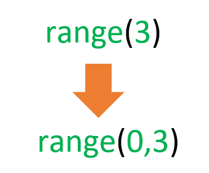
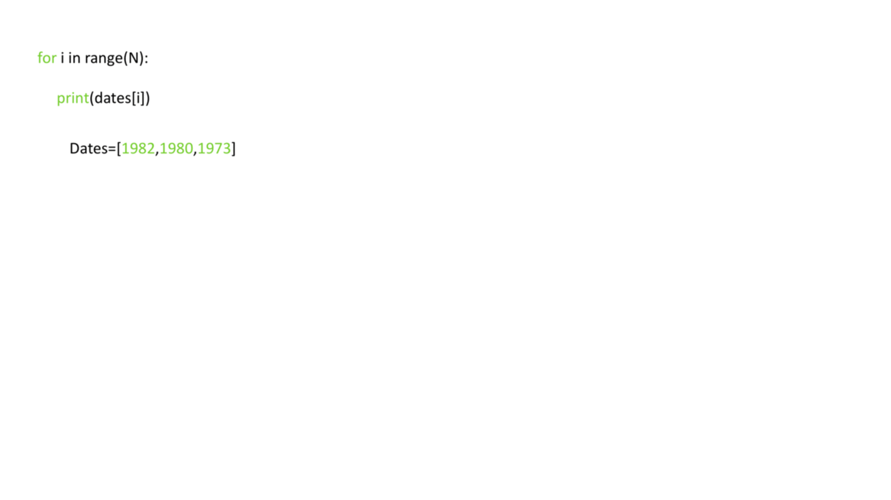
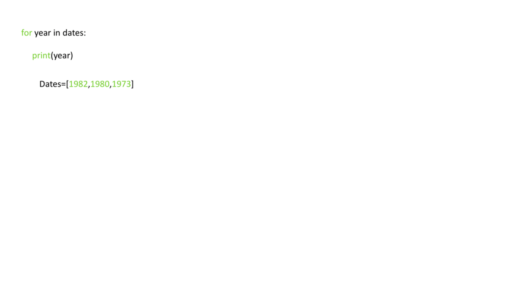
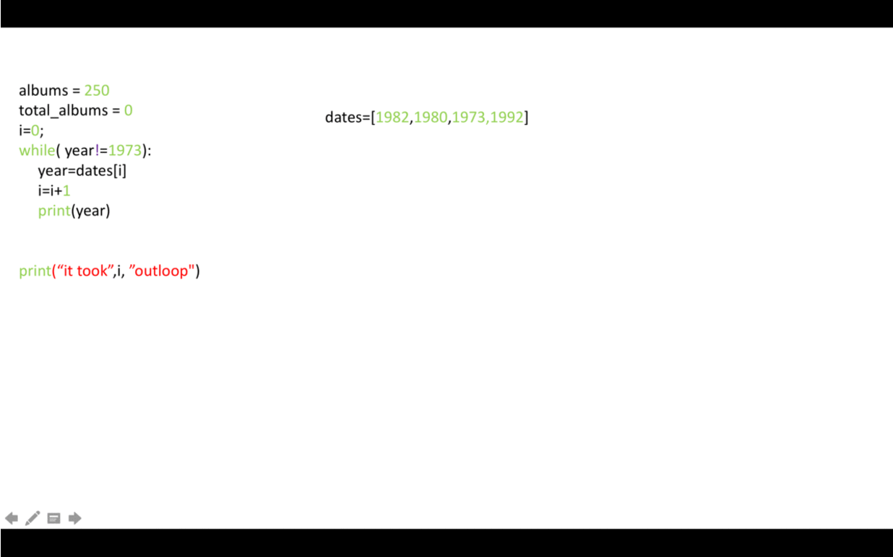

`# Loops in Python

This is the link to version **jupiter notebook** [Loops](3-2-3-Loops.ipynb)

## Objectives

After completing this lab you will be able to:
- work with the loop statements in Python, including for-loop and while-loop

## Loops in Python

**Welcome!** This notebook will teach you about the loops in the python 

### Table of Contents

- Loops
	- Range
	- What is for loop?
	- What is while loop?

- Quiz on Loops

## Loops

### Range

Sometimes, you might want to repeat a given oepration many times. Repeated executions like this are performed by **loops**. We will look at two types of loops, `for` loop and `while` loops.

Before we discuss loops lets discuss the `range` object. It is helpful to think of the range object as an ordered list. For now, let's look at the simplest case. If we would like to generate an object that contains elements ordered from 0 to 2 we simply use the following command:

```python
# Use the range

>>> range(3)
range(0, 3)
```



***NOTE : While in Python 2.x it returned a list as seen in video lessons, in 3.x it returns a range object***

## What is `for` loop?

The `for` loop enables you t execute a code block multiple times. For example, you would use this if you would like to print out every element in a list.

Let's try to use a `for` loop to print all the years presented in the list `dates`:

This can be done as follows:

```python 

>>> dates = [1982, 1980, 1973]
>>> N = len(dates)
>>> 
>>> for i in range(N):
...     print(dates[i])
... 
1982
1980
1973
```

The code in the indent is executed `N` times, each time the value of `i` is increased by 1 for every execution. The statement executed is to `print` out the value in the list at index `i` as shown here:



In this example we can print out a sequence of numbers from 0 to 7:

```python
# Example of for loop

>>> for i in range(0, 8):
...     print(i)
... 
0
1
2
3
4
5
6
7
```

In Python we can derectly access the elements in the list as follows:

```python
# Example of for loop, loop through list

>>> for year in dates:
...     print(year)
... 
1982
1980
1973

```



We can change the elements in a list:

```python
# Use for loop to change the elements in list

>>> squares = ['red', 'yellow', 'green', 'purple', 'blue']
>>> 
>>> for i in range(0, 5):
...     print('Before square', i, 'is', squares[i])
...     squares[i] = 'white'
...     print('After square', i, 'is', squares[i])
... 
Before square 0 is red
After square 0 is white
Before square 1 is yellow
After square 1 is white
Before square 2 is green
After square 2 is white
Before square 3 is purple
After square 3 is white
Before square 4 is blue
After square 4 is white
```

We can access the index and the elements of a list as follows:

```python
# Loop throught the list and iterate on both index and element vlaue

>>> squares = ['red', 'yellow', 'green', 'purple', 'blue']
>>> for i, square in enumerate(squares):
...     print(i, square)
... 
0 red
1 yellow
2 green
3 purple
4 blue
```

## What is `while` loop?

As you can see, the `for` loop is used for a controlled flow of repetition. However, what if we don't know when we want to stop the loop? What if we want to keep executing a code block until a certain condition is met? The `while` loop exists as a tool for repreated execution based on a condition. The code block will keep being executed until the given logical condition returns a **False** boolean value.

Here's how a while loop works:

1. First, you specify a condition that the loop will check before each interation (repetition) of the code block.
2. If the condition is initially true, the code block is executed.

3.  After executing the code block, the condition is checked again.

4. If the condition is still true, the code block is executed again.
5. Steps 3 and 4 repeat until the condition becomes false.
6. Once the condition becomes false, the loop stops, and the program continues with the next line of code after the loop.

**Here's an example of a while loop that prints numbers from 1 to 5**:

```python
>>> count = 1
>>> while count <= 5:
...     print(count)
...     count += 1
... 
1
2
3
4
5
```

In this example, the condition **count <= 5** is checked before each iteration. As long as count is less than or equal to 5, the code block inside the loop is executed. After each iteration, the value of count is incremented by 1 using count += 1. Once count reaches 6, the condition becomes false, and the loop stops.

Let's say we would like to iterate through list `dates` and stop at the year 1973, then print out the number of iterations. This can be done with the following block of code:

```python
# While Loop Example 

>>> dates = [1982, 1980, 1973, 2000]
>>> 
>>> i = 0
>>> year = dates[0]
>>> 
>>> while (year != 1973):
...     print(year)
...     i += 1
...     year = dates[i]
... 
1982
1980
>>> print('It took', i,'repetitions to get out of loop.')
It took 2 repetitions to get out of loop.
```

A while loop interates merely until the condition in the argument is not met, as shown in the following figure:




**The main difference between a while loop and a for loop in Python is how they control the flow execution and handle iterations.**

### Key point of For Loop:
1. A for loop iterates over a sequence(such as a list, string, or range) or any object that supports interation.
2. It has a predefined number of interations based on the length of the sequence or the number of items to iterate over.
3. It automatically handles the iteration and does not require maintaining a separate variable for tracking the iteration count.
4. It simplifies the code by encapsulating the iteration logic within the loop itself.
5. It is commonly used when you know the exact number of iterations or need to iterate over each item in a collection.

## Practise Excercises on Loops

Write a `for` loop the prints out all the element between **-5** and **5** using the range function

```python
>>> for i in range(-5, 6):
...     print(i)
... 
-5
-4
-3
-2
-1
0
1
2
3
4
5
```

Print the elements of the following list: `Genres = ['rock', 'R&B', 'Soundtrack', 'R&B', 'soul', 'pop']` Make sure you follow Python conventions.

```python

>>> Genres = [ 'rock', 'R&B', 'Soundtrack', 'R&B', 'soul', 'pop']
>>> for i in Genres: 
...     print(i)
... 
rock
R&B
Soundtrack
R&B
soul
pop
```

Write a for loop that prints out the following list: `squares = ['red' , 'yellow', 'green', 'purple', 'blue']`

```python
>>> squares = ['red', 'yellow', 'green', 'purple', 'blue']
>>> for square in squares:
...     print(square)
... 
red
yellow
green
purple
blue
```

Write a while loop to display the values of the Rating of an album playlist stored in the list `PlayListRatings`. If the score is less than 6, exit the loop. The list `PlayListRatings` is given by `PlayListRatings = [10, 9.5, 10, 8, 7.5, 5, 10, 10]`

```python
>>> PlayListRatings = [10, 9.5, 10, 8, 7.5, 5, 10, 10]
>>> index = 0
>>> while not (PlayListRatings[index] <= 6):
...     print(PlayListRatings[index])
...     index += 1
...     if index >= len(PlayListRatings) :
...             exit
... 
10
9.5
10
8
7.5
```

Write a while loop to copy the stirngs `orange` of the list `sqeuares` to the list `new_squaress`. Stop and exit the loop if the value on the list is not `orange`:

```python

>>> squares = ['orange', 'orange', 'purple', 'blue ', 'orange']
>>> new_squares = []
>>> 
>>> index = 0
>>> while (index < len(squares)) and (squares[index] == 'orange'):
...     new_squares.append(squares[index])
...     index += 1
... 
>>> new_squares
['orange', 'orange']
```

### Some real-life probems!

Your little brother has just learned multiplication tables in school. Today he has learned of 6 and 7. Help him memorise both the tables by printing them using `for` loop.

> Write two for loops. One to print the multiplication table of 6 and the other for 7.

```python
>>> for i in range(1, 10):
...     print(f'6 * {i} = {6* i} \t 7 * {i} = {7 * i}')
... 
6 * 1 = 6        7 * 1 = 7
6 * 2 = 12       7 * 2 = 14
6 * 3 = 18       7 * 3 = 21
6 * 4 = 24       7 * 4 = 28
6 * 5 = 30       7 * 5 = 35
6 * 6 = 36       7 * 6 = 42
6 * 7 = 42       7 * 7 = 49
6 * 8 = 48       7 * 8 = 56
6 * 9 = 54       7 * 9 = 63
```

The following is a list of animals in a National Zoo. `Animals = ['lion', 'giraffe', 'gorilla', 'parrots', 'crocodile', 'deer', 'swan']`

Your brother need to write an essay on the animals whose names are made of 7 letters. Help him find those animals through a `while` loop and create a separate list of such animals.

> Use while loop to interate over the elements of the list. Use if-else statement inside the for loop to check the length of each element and if the length is 7, add the element to a new list.

```python

>>> Animals = ['lion', 'giraffe', 'gorilla', 'parrots', 'crocodile', 'deer', 'swan']
>>> new_list = []
>>> index = 0
>>> while (index < len(Animals)) :
...     if len(Animals[index]) == 7 :
...             new_list.append(Animals[index])
...     index += 1
... 
>>> new_list
['giraffe', 'gorilla', 'parrots']
```
