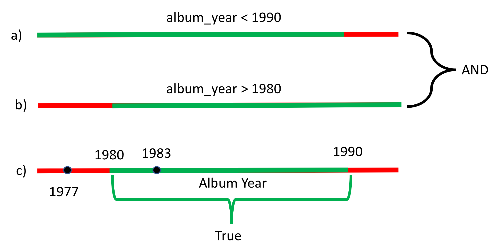

# 3.3.3 Functions in Python

## Objectives

After completing this lab you will be able to:

- Understand functions and variables
- Work with functions and variables

## Functions in Python

**Welcome!** This notebook will teach you about the functions in the Python Programming Language. By the end of this lab, you'll know the basic concepts about function, variables, and how to use functions.

## Table of contents

- Functions
	- What is function?
	- Variables
	- Functions Make Things Simple

- Pre-defined functions
- Using if/else Statements and Loops in Functions
- Setting default argument values in your custom functions
- Global variables
- Scope of a Variable
- Collections and Functions
- Quiz on Loops

## Functions 

A function is a reusable block of code which performs operations specified in the function. They let you break down tasks and allow you to reuse your code in different programs.

There are two types of function:
	- Pre-defined functions
	- User defined functions

### What is function?

You can define functions to provide the required functionality. Here are simple rules to define a function in Python:
- Functions block begin `def` followed by the function `name` and parentheses `()`.
- There are input parameters or arguments that should be placed within these parentheses.
- You can also define parameters inside these parentheses.
- There is a body within every function that starts with a colon `:` and is indented.
- You can also place documentation before the body.
- The statement `return` exits a function, optionally passing back a value.

An example of a function that dds on to the parameter `a` prints and returns the output as `b`:

```python
# First function example: Add 1 to a and store as b

>>> def add(a):
...     '''
...     add 1 to a
...     ```
...     '''
...     b = a +1
...     print(a, 'if you add one', b)
...     return(b)
... 
>>> add(2)
2 if you add one 3
3
```

The figure below illustrates the terminology:


We can obtain help about a function:

```python
# Get a help on add function
help(add)
```

We can call the function:
```python
# Call the function add()
add(1)
```

If we call the function with a new input we get a new result:

```python
>>> add(2)
2 if you add one 3
3
```

We can create different functions. For example, we can create a function that multiplies two numbers. THe numbers will be represented by the variables `a` and `b`:

```python
>>> def Mult(a, b):
...     c = a * b
...     return(c)
...     print('This is not printed')
... 
>>> result = Mult(12, 2)
>>> print(result)
24
```

The same function can be used for different data types. For example, we can multiply two integers:

```python
# Use mult() multiply two integers
>>> Mult(2, 3)
6
```
Note how the function terminates at the `return` statement, while passing back a value. This value can be further assigned to a different variable as desired.

The same function can be used for different data types. For example, we can multiply two integers:

Two floats:

```python
6
>>> Mult(10.0, 3.14)
31.400000000000002
```
We can even replicate a string by multiplyting with an integer:

```python
# Use mult() multiply two different type values together 

>>> Mult(2, "Phoem")
'PhoemPhoem'
```

## Variables

The input to a function is called a formal parameter 

A variable that is declared indide a function is called a local vaiable. The parameter only exists within the function (i.e., the point where the function starts and stops).

A variable that is declared outside a function definition is a global variable, and its value is accessible and modifiable throughout the program. We will discuss more about global variables at the end of the lab.

```python
>>> def square(a):
...     # Local variable b
...     b = 1
...     c = a * a + b
...     print(a, 'if you square + 1', c)
...     return(c)
```

The labels are displayed in the figure:


We can call the function with an input of **3**:

```python

>>> x = 3
>>> # Makes function call and return function a y
>>> y = square(x)
3 if you square + 1 10
>>> y
10
```

We can all the function with an input of **2** in a different manner:

```python
# Directly enter a number as paremeter

>>> square(2)
2 if you square + 1 5
5

```

If there is no `return` statement, the function returns `None`. The following two functions are equivalent:

```python

# Define functions, one with return value None and other without return value

def MJ():
	print('Michael Jackson')

def MJ1():
	print('Michael Jackson')
	return(None)
```

```python
>>> MJ()
Michael Jackson
```

```python
>>> MJ1()
Michael Jackson
```

Create a function `con` that concatenates two strings using the addition operation:

```python
>>> def con(a,b):
...     return(a + b)
... 
```

```python
>>> con("this ", " is")
'this  is'
```

## Functions Make Things Simple

Consider the two liens of code in **Block 1** and **Block 2**: the procedure for each block is identical. The only thing that is different is the variable names and values.

### Block 1:
```python
>>> a1 = 4
>>> b1 = 5
>>> c1 = a1 + b1 + 2 * a1 * b1 - 1
>>> if (c1 < 0):
...     c1 = 0
... else:
...     c1 = 5
... 
>>> c1
5
```

### Block 2:
```python
>>> a2 = 0
>>> b2 = 0
>>> c2 = a2 + b2 + 2 * a2 * b2 - 1
>>> if c2 < 0:
...     c2 = 0
... else:
...     c2 = 5
... 
>>> c2
0
```

We can replace the lines of code with a function. A function combines many instructions into a single line of code. Once a function is defined, it can be used repeatedly. You can invoke the same function many times in your program. You can save your function and use it in another program or use someone else's function. The lines of code in code `Block 1` and  code `Block 2` can be replaced by the following function:

```python3

>>> def Equation(a, b):
...     c = a + b + 2 * a * b - 1
...     if (c < 0):
...             c = 0
...     else:
...             c = 5
...     return(c)
... 

```
This function takes two inputs, a and b, then applies several operations to return c. We simply define the function, replace the instructions with the function, and input the new values of `a1, b1` and `a2, b2` as inputs. The entire process is demonstrated in the figure:


Code **Blocks 1** and **Block 2** can now be replaced with code **Block 3** and code **Block 4**

### Block 3:

```python3
>>> a1 = 4
>>> b1 = 5
>>> c1 = Equation(a1, b1)
>>> c1
5
```

### Block 4:

```python
>>> a2 = 0
>>> b2 = 0
>>> c2 = Equation(a2, b2)
>>> c2
0
```

## Pre-defined functions

There are many pre-defined functions in Python, so let's start with the simple ones.

The `print()` functions:

```python
# Build-in function print()

>>> album_ratings = [10.0, 8.5, 9.5, 7.0, 7.0, 9.5, 9.0, 9.5]
>>> print(album_ratings)
[10.0, 8.5, 9.5, 7.0, 7.0, 9.5, 9.0, 9.5]
```

The `sum()` function adds all the elements in a list or tuple:

```python
# Use sum() to add every element in a list or tuple together 

>>> sum(album_ratings)
70.0
```

The `len()` function returns the length of a list or tuple:

```python
# Show the lenght of the list or tuple

>>> len(album_ratings)
8
```

## In-built functions

In python, an in-built functions is a pre-defined function that is always available for use, providing common functionality without requiring any imports.

```python

#You will see below will return an error as integer alone is not considered while using a function.It either has to be in the form of tuple, list or a set.

>>> sum(1, 2)
Traceback (most recent call last):
  File "<stdin>", line 1, in <module>
TypeError: 'int' object is not iterable
```

```python

>>> # Define a tuple
>>> a = (1, 2)
>>> 
>>> # Pass the tuple to the sum function and store the result in a variable
>>> c = sum(a)
>>> 
>>> # Print the result 
>>> print(f'The sum of the elementsi n the tuple {a} is {c}.')
The sum of the elementsi n the tuple (1, 2) is 3.
```

```python
>>> # Define a list
>>> a = [1, 2]
>>> 
>>> # Pass the list to the sum function and store the result in a variable 
>>> c = sum(a)
>>> 
>>> # Print the result
>>> print(f'The sum of the elements in the list {a} is {c}.')
The sum of the elements in the list [1, 2] is 3.
```

## Using `if/else` statements and loops in functions

The `return()` function is particularly useful if you have any If statements in the function, when you want your output to be dependent on some condition:

```python
>>> # Functin example
>>> 
>>> def type_of_album(artist, album, year_released):
...     print(artist, album, year_released)
...     if year_released > 1980:
...             return 'Modern'
...     else:
...             return 'oldie'
... 
>>> x = type_of_album('Michael Jackson', 'Thriller', 1980)
Michael Jackson Thriller 1980
>>> print(x)
oldie
```

We can use a loop in a function. For example, we can `print` out each element in a list:

```python
>>> # Print the list using for loop
>>> 
>>> def PrintList(the_list):
...     for element in the_list:
...             print(element)
... 
```

```python
>>> # Implement the printlist function
>>> 
>>> PrintList(['1', 1, 'the man', 'abc'])
1
1
the man
abc
```

## String comparison in Functions

The relational operators compare the Unicode values of the characters of the string from the zeroth index till the end of the string. It then returns a boolean value according to the operator used.

```python
>>> # Compare Two Strings Directly using in operator
>>> # add string
>>> string = 'Michael Jackson is the best'
>>> 
>>> # Define a function
>>> def check_string(text):
...     
... # Use if else statement and 'in' operator to compare the string
...     if text in string:
...             return 'String matched'
...     else:
...             return 'String not matched'
... 
>>> check_string('Michael')
'String matched'
```

This program uses a user-defined functoin named compareStrings() to compare two strings.

This function receives both strings as its argument and returns 1 if both strings are equal using `==` operator

```python
>>> # Compare two strings using == operator and function
>>> def compareStrings(x, y):
... # Use if else statement to compare x and y
...     if x == y:
...             return 1
... 
>>> # Declare two different variables as string1 and string2 and pass string in it
>>> string1 = 'Michael Jackson is the best'
>>> string2 = 'Michael Jackson is the best'
>>> 
>>> # Declare a variable to store result after comparing both the strings
>>> check = compareStrings(string1, string2)
>>> 
>>> # Use if else statement to compare the string

>>> if check == 1:
...     print('\nString Matched')
... else: 
...     print('\nString not Matched')
... 

String Matched
```

## Count the Frequency of Words Appearing in a string Using a dictionary.

Find the count of occurence of any word in our string using python. This is what we are going to do in this section, count the number of word in a given string and print it.

Lets suppose we have a string and the word and we need to find the count of occurence of this word in our string using python. This is what are going to do in this section, count the number of word in a given string and print it.

The first thing, we will do is define a function and then create a list that will be empty initially.

Next, we will ad a code to convert the string to do a list. Python string has a split() method. It takes a string and some separator to return a list.

Now we will declare an empty dictionary.

Next we will add code using for loop to iterate the words and value will count the frequency of each words in the string and store them to the dictionary.

Finally we will print the dictionary.

## Setting default argument values in your custom functions

You can set a default value for arguments in yoiur funtion. For example, in the `isGoodRating()` function, what if we wanted to create a threshold for what we consider to be a good rating? Perhaps by default, we should have a default rating of 4:

```python
>>> def isGoodRating(rating=4):
...     if (rating < 7):
...             print("this album sucks it's rating is", rating)
...     else:
...             print("this album is good its rating is", rating)
... 
>>> isGoodRating()
this album sucks it's rating is 4
>>> isGoodRating(10)
this album is good its rating is 10
```

## Global variables

So far, we've been creating variables within functions, but we have not discussed variables outside the function. These are called global variables.
Let's try to see what `printer1` returns:

```python
>>> # Example of global variable
>>> 
>>> artist = 'Michael Jackson'
>>> def printer1(artist):
...     internl_var1 = artist
...     print(artist, 'is an artist')
... 
>>> printer1(artist)
Michael Jackson is an artist
>>> # try running the following code 
>>> # printer1(internal_var1)
```

**We got a Name Error: `name 'internal_var' is not defined`. Why?

It's because all the variables we create in the function is a **local variable**, meaning that the variable assignment does not persist outside the function.

But there is a way to create **global variables** from within a function as follows:

```python
>>> artist = 'Michael Jackson'
>>> 
>>> def printer(artist):
...     global internal_var
...     internal_var = 'Whitney Houston'
...     print(artist, 'is an artist')
... 
>>> printer(artist)
Michael Jackson is an artist
>>> printer(internal_var)
Whitney Houston is an artist
```

## Scope of a Variable 

The scope of a variable is the part of that program where that variable is accessible. Variables that are declared outside of all function definitions, such as the `myFavouriteBand` variable in the code shown here, are accessible from anyware within the program. As a result, such variables are said to have global scope, and are known as global variables. `myFavouriteBand` is a global variable, so it is accessible from within the `getBandRating` function, and we can use it to determine a band's rating. We can also use it outside of the function, and we can use it to determine a band's rating. We can also use it outside of the function, such as when we pass it to the print function to display it:

```python
>>> # Example of global variable 
>>> 
>>> myFavouriteBand = 'AC/DC'
>>> 
>>> def getBandRating(bandname):
...     if bandname == myFavouriteBand:
...             return 10.0
...     else:
...             return 0.0
... 
>>> print("AC/DC's rating is:", getBandRating('AC/DC'))
AC/DC's rating is: 10.0
>>> print("Deep Purple's rating is:", getBandRating('Deep Purple'))
Deep Purple's rating is: 0.0
>>> print("My favourite band is:", myFavouriteBand)
My favourite band is: AC/DC
```

Take a look at this modified version of our code. Now the `myFavouriteBand` variable is defined within the `getBandRating` function. A variable that is defined within a function is said to be a local variable of that function. That means that it is only accessible from within the function in which it is defined. Out `getBandRating` function will still work, because `myFavouriteBand` is still defined within the function. However, we can no longer print `myFavouriteBand` is still defined within the function. However, we can no longer print `myFavouriteBand` outside our function, because it is a local variable of our `getBandRating` funciton; it is only defined within the `getBandRating` function:

```python
# Deleting the variable "myFavouriteBand" from the previous example to demonstrate an example of a local variable 

del myFavouriteBand

# Example of local variable

def getBandRating(bandname):
    myFavouriteBand = "AC/DC"
    if bandname == myFavouriteBand:
        return 10.0
    else:
        return 0.0

print("AC/DC's rating is: ", getBandRating("AC/DC"))
print("Deep Purple's rating is: ", getBandRating("Deep Purple"))
print("My favourite band is", myFavouriteBand)
```

## Collections and Functions

When the number of arguments are unknown for a function, They can all be packed into a tuple as shown:

```python
>>> def printAll(*args): # All the arguments are 'packed' into args which can be treated like a tuple
...     print('No of arguments:', len(args))
...     for argument in args:
...             print(argument)
... 
>>> # printAll with 3 arguments
>>> printAll('Horsefeather', 'Adonis', 'Bone')
No of arguments: 3
Horsefeather
Adonis
Bone
>>> # printAll with 4 arguments 
>>> printAll('Sidecar', 'Long Island', 'Mudslide', 'Carriage')
No of arguments: 4
Sidecar
Long Island
Mudslide
Carriage
```
Similarly, The arguments can also be packed into a dictionary as shown:

```python

>>> def printDictionary(**args):
...     for key in args:
...             print(key + ' : ' + args[key])
... 
>>> printDictionary(Country='Canada', Province = 'Ontario', City = 'Toronto')
Country : Canada
Province : Ontario
City : Toronto
```

Functions can be incredibly powerful and versatile. They can accept (and return) data types, objects and even other functions as arguements. Consider the example below:

```python
>>> def addItems(list):
...     list.append('Three')
...     list.append('Four')
... 
>>> myList = ['One', 'Two']
>>> addItems(myList)
>>> 
>>> myList
['One', 'Two', 'Three', 'Four']
```

Note how the changes made to the list are not limited to the functions scope. This occurs as it is the lists **reference** that is passed to the function - Any changes made are on the orignal instance of the list. Therefore, one should be cautious when passing mutable objects into functions.

## Quiz of Functions

Come up with a function that divides the first input by the second input:

```python

>>> def div(a, b):
...     return(a/b)
... 
```
Use the function `con` for the following question.

```python

>>> def con(a, b):
...     return( a + b)
... 
```

Can the `con` function we defined before be used to add two integers or strings?
```python
>>> con(2, 2)
4
```

Can the `con` function we defined before be used to concatenate lists or tuples?

```python
>>> con(['a', 1], ['b', 1])
['a', 1, 'b', 1]
```

Write a function code to find total count of word `little` in the given string: `mary had a little lamb Little lamb, little lamb Mary had a little lamb. Its fleece was white as snow And everywhere that Mary went Mary went, Mary went everywhere that Mary went the lamb was sure to go`

```python
def freq(string,passedkey):

    #step1: A list variable is declared and initialized to an empty list.
    words = []

    #step2: Break the string into list of words
    words = string.split() # or string.lower().split()

    #step3: Declare a dictionary
    Dict = {}

    #step4: Use for loop to iterate words and values to the dictionary
    for key in words:
        if(key == passedkey):
            Dict[key] = words.count(key)   
    #step5: Print the dictionary
    print("Total Count:",Dict)
s
#step6: Call function and pass string in it
freq("Mary had a little lamb Little lamb, little lamb Mary had a little lamb.Its fleece was white as snow And everywhere that Mary went Mary went, Mary went Everywhere that Mary went The lamb was sure to go","little")
```
